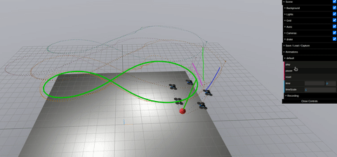
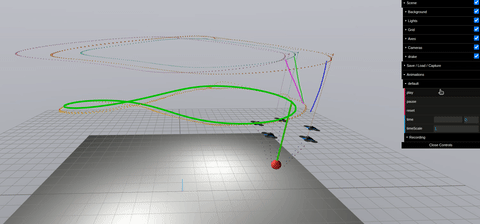
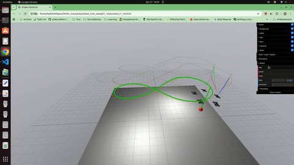
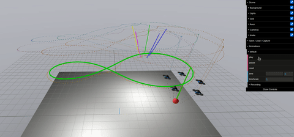
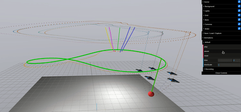
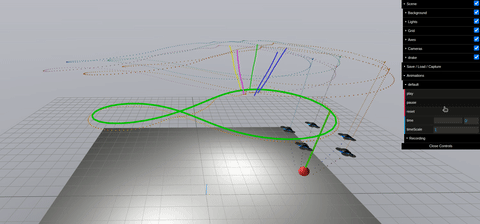

# Tether_Grace

**Passive fault tolerance through a tension-to-thrust feed-forward identity.**
Hybrid input-to-state stability for decentralized multi-UAV slung-load
transport under abrupt cable severance.

This repository contains the complete research artefact stack for the
manuscript:

> H. Hajieghrary and P. Schmitt, *Passive Fault Tolerance through
> Tension-to-Thrust Feed-Forward: Hybrid Input-to-State Stability for
> Decentralized Multi-UAV Slung-Load Transport under Abrupt Cable
> Severance*, submitted to IEEE Transactions on Control Systems
> Technology.
> Camera-ready PDF: [`IEEE_T-CST_camera_ready/Main.pdf`](IEEE_T-CST_camera_ready/Main.pdf).

The codebase delivers the full thread end-to-end: the formal proofs in
LaTeX, the Drake-based C++ simulator, the controller stack, the
campaign harness that produces every published number, the Python
analysis pipeline that builds every published figure, and the
verification tests that back each theorem against the constants
actually deployed in the simulator.

---

## Table of contents

1. [The thesis in one paragraph](#1-the-thesis-in-one-paragraph)
2. [Repository layout](#2-repository-layout)
3. [The architectural claim](#3-the-architectural-claim-and-three-formal-guarantees)
4. [System under study](#4-system-under-study)
5. [Controller stack](#5-controller-stack)
6. [Theorems and proofs](#6-theorems-and-proofs)
7. [Code-to-math correspondence](#7-code-to-math-correspondence)
8. [Build and run](#8-build-and-run)
9. [Reproducing the published numbers](#9-reproducing-the-published-numbers)
10. [Simulation outputs](#10-simulation-outputs)
11. [Verification tests](#11-verification-tests)
12. [Manuscript sources & video presentations](#12-manuscript-sources)
13. [Dependencies](#13-dependencies)
14. [Project conventions and provenance](#14-project-conventions-and-provenance)
15. [Citing](#15-citing)
16. [License](#16-license)

---

## 1. The thesis in one paragraph

A peer cable severs unannounced. The remaining cables redistribute the
payload load within one payload-pendulum period
(τ<sub>pend</sub> ≈ 2 s for a 1.25 m rope). Any controller that relies
on a detector-classifier-supervisor pipeline must complete that pipeline
in less time, which is structurally infeasible at multirotor tick rates.
We show that the fault response collapses into a **single decentralized
identity**, $T_i^{\mathrm{ff}}(t) = T_i(t)$, equating each drone's
altitude thrust feed-forward to its own measured rope tension. With
this identity wired into an otherwise standard PD/QP/attitude cascade,
the closed loop is **hybrid practically input-to-state stable** across
a finite sequence of $F \le N{-}2$ unannounced severances, with
closed-form Lyapunov decay rate $\lambda$ and per-fault-cycle
contraction $\rho \in (0,1)$, on a slack-excursion-bounded admissibility
domain. The identity is the only nonstandard element of the controller;
the rest is a textbook cascade.

---

## 2. Repository layout

| Path | Role |
|------|------|
| [`Research/`](Research) | Active source: C++ simulator, controller stack, Python analysis pipeline, campaign runners, verification tests. |
| [`Research/cpp/`](Research/cpp) | Drake-based simulator and controller implementations. Builds a single executable, `decentralized_fault_aware_sim`. |
| [`Research/analysis/`](Research/analysis) | Python pipeline. Consumes simulation CSVs and emits publication figures, summary tables, and LaTeX subfiles. |
| [`Research/scripts/`](Research/scripts) | Shell wrappers that pin canonical CLI-flag combinations for each campaign and write into separate output directories. |
| [`Research/tests/`](Research/tests) | Numerical regression tests; each maps one-to-one to a manuscript theorem and re-validates it against deployed controller constants. |
| [`IEEE_T-CST_camera_ready/`](IEEE_T-CST_camera_ready) | Camera-ready manuscript (LaTeX + compiled PDF). The canonical algorithmic and mathematical specification of the work. |
| [`IEEE_T-CST_ext/`](IEEE_T-CST_ext) | Extended pre-camera-ready manuscript variant. Same substantive content; longer expositional form. |
| [`Tether_Lift/`](Tether_Lift) | Upstream baseline simulator vendored as a read-only git submodule. Provides the URDF quadrotor, rope-force system, and devcontainer; not modified here. |
| [`output/`](output) | Simulation artefacts produced by the campaign runners (one subdirectory per campaign). Raw CSVs, Meshcat replays, summary tables, and a presentation video. |
| [`.github/`](.github) | Project-level workflow assets: `agents/` (subagent contracts) and `skills/` (authorial-voice and codebase-theorist skill packs). |

A new reader's recommended trajectory:

1. Read this file end-to-end (you are here).
2. Open the camera-ready PDF [`IEEE_T-CST_camera_ready/Main.pdf`](IEEE_T-CST_camera_ready/Main.pdf) for the formal results.
3. Read [`Research/cpp/README.md`](Research/cpp/README.md) for the simulator and controller details.
4. Read [`Research/scripts/README.md`](Research/scripts/README.md) and [`Research/analysis/README.md`](Research/analysis/README.md) for how the campaigns are produced and analysed.
5. Run the smoke test in [§8.3](#83-smoke-test) to confirm the toolchain is healthy.

---

## 3. The architectural claim and three formal guarantees

### 3.1 The architectural commitment

The plant is a continuous-time hybrid system: $N$ multirotor UAVs
cooperatively lifting a point-mass payload through $N$ flexible
Kelvin–Voigt cables. A cable severance is a discrete decrement of the
constraint set (one cable's tension snaps to zero, $|\mathcal{S}|$
drops by one), not an additive perturbation. Three structural features
of the plant — unilateral compliant coupling, hybrid
constraint-cardinality transitions at severance, and strict
information locality (each drone sees only its own state, its own rope
tension, and a local payload-velocity estimate) — rule out classical
cooperative-transport architectures. The admissible information set
contains **no peer state, no fault flag, no shared scheduler, and no
inter-drone communication**.

In this category, we read the structural transition off the
actuator-side measurement on the plant's native timescale and convert
it directly into a thrust increment through the identity
$T_i^{\mathrm{ff}}(t) = T_i(t)$.
The announcement-detection-reconfiguration timeline is *eliminated as a
system-level construct*, not replaced with a faster substitute.

Four architectural properties follow as consequences:

- **Locality.** The information set $\mathcal{I}_i$ contains no peer state, no fault flag, no shared scheduler.
- **Passivity.** The same identity that operates pre-fault produces the post-fault response, with no detector, classifier, or reassignment rule in the loop.
- **Robustness to multi-agent failure.** The recovery envelope carries by induction over $F \le N - 2$ unannounced severances under the actuator-margin envelope $m_L g/(N{-}F) \le \kappa_{\mathrm{act}} f_{\max}$.
- **Team-size independence.** The per-drone law and lemma stack carry no $N$ structurally; the dependence concentrates in two scalars $m_L g/N$ and $m_L g/(N{-}F)$.

### 3.2 Three closed-form guarantees

Three theorems back the architectural claim, on the slack-excursion-bounded
domain $\Omega_\tau^{\mathrm{dwell}}$ characterized by H1 (slack run
≤ 40 ms; duty cycle ≤ 2.5 %), H2 (spaced-fault dwell
$\tau_d \ge \tau_{\mathrm{pend}}$), and H3 (Doctrine D1, single-active-regime QP).

| # | Theorem | Manuscript location | What it gives |
|---|---|---|---|
| **C1** | Taut-cable reduction | Section II.C of `IEEE_T-CST_camera_ready/Sections/Section_II_Problem_Statement.tex` | $\mathcal{O}(\delta + \eta_{\max})$ closed-loop deviation between the bead-chain truth model and the lumped reduced plant on $\Omega_\tau^{\mathrm{dwell}}$, justifying $k_{\mathrm{eff}} = k_s/N_{\mathrm{seg}} \approx 2778$ N/m. |
| **C2** | Hybrid practical-ISS recovery | Section IV (Stability Analysis) | Closed-form recovery envelope with Lyapunov decay rate $\lambda = \min(\alpha_z, \alpha_{xy})$ and per-fault-cycle contraction $\rho = \exp(-\lambda \tau_{\mathrm{pend}}) \in (0,1)$ for any sequence of $F \le N - 2$ unannounced severances satisfying H1–H3. |
| **C3** | Closed-form $L_1$ gain bound | Section V.A | Sufficient discrete-time stability bound $\Gamma < \Gamma^\star = 2/(T_s p_{22}) \approx 4.76\times 10^5$ on the $L_1$ adaptive gain, removing the dominant $L_1$ hyper-parameter from empirical tuning. |

The three theorems are supported by **five lemmas** in Section IV
(tension cancellation, altitude ISS via the closed-loop Lyapunov matrix,
anti-swing damping invariance to $N_s$, bounded fault-jump, dwell-cycle
contraction) plus three propositions in Section V (slack-activation
regime, recursive feasibility of the MPC tick QP, globally
tension-optimal reshape for $N=4$). Every lemma has a verification test
under [`Research/tests/`](Research/tests).

### 3.3 Scope limits stated up front

The manuscript and the codebase are explicit that three regimes lie
**outside the analysis domain**:

- **Rapid multi-fault** ($\tau_d < \tau_{\mathrm{pend}}$) violates H2 and voids the dwell-cycle contraction.
- **Long slack excursions** (> 40 ms) violate H1 and exit $\Omega_\tau^{\mathrm{dwell}}$.
- **QP fallback** (solver infeasibility forcing the component-wise clamp) violates H3 and breaks D1.

A second class lies **outside the architectural category itself**:
drone-side faults (rotor loss, IMU failure, brownout), soft cable
failures (fraying, attachment slip), tension-sensor failures, and
payload-attitude rigid-body dynamics. These do not self-announce
through the actuator-side rope-tension channel that the identity reads
and require a different announcement mechanism. They are not gaps in
the present campaign.

---

## 4. System under study

### 4.1 Plant parameters

| Parameter | Value | Source |
|---|---:|---|
| Drone mass $m_i$ | 1.5 kg | Tether_Lift URDF |
| Drone inertia (diagonal) | $\mathrm{diag}(0.0123, 0.0123, 0.0224)$ kg·m² | Tether_Lift URDF |
| Payload mass $m_L$ (canonical) | 10 kg | Capability demonstration |
| Payload mass $m_L$ (P2-B sweep) | $\{2.5, 3.0, 3.5, 3.9\}$ kg | Mass-mismatch design range |
| Fleet size $N$ | 5 (canonical), tested at 4 and 6 | `--num-quads` |
| Rope rest length $L$ | 1.25 m | 6 mm aramid-core lift sling |
| Per-segment stiffness $k_s$ | 25 000 N/m | Bead-chain segment |
| Effective lumped stiffness $k_{\mathrm{eff}}$ | $k_s / N_{\mathrm{seg}} = 2778$ N/m | Reduction theorem (C1) |
| Per-segment damping $c_s$ | 60 N·s/m | $\zeta \approx 1.2$ overdamped |
| Number of beads per rope | 8 | $N_{\mathrm{seg}} = N_b + 1 = 9$ |
| Rope timescale $\tau_{\mathrm{rope}}$ | $\approx 6.3$ ms | $2\pi\sqrt{m_{\mathrm{bead}}/k_s}$ |
| Pendulum timescale $\tau_{\mathrm{pend}}$ | $\approx 2.24$ s | $2\pi\sqrt{L/g}$ |
| Timescale ratio $\delta$ | $\approx 0.003$ | $\tau_{\mathrm{rope}} / \tau_{\mathrm{pend}}$ |
| Actuator ceiling $f_{\max}$ | 150 N | Per drone |
| Tilt limit $\theta_{\max}$ | 0.6 rad | QP constraint |
| Simulator step $\Delta t$ | $2 \times 10^{-4}$ s | RK3 integrator, factor-10 margin under bead-chain $\omega_n$ |

### 4.2 Reference trajectory

The canonical reference is a 3-D Bernoulli lemniscate with a vertical
oscillation:

```
p_L^d(x,y) = (a cos φ / (1 + sin²φ),  a sin φ cos φ / (1 + sin²φ))
p_L^d(z)   = z₀ + h_z sin φ
φ(t)       = 2π (t − t₀) / T_ref
```

with $a = 3.0$ m, $T_{\mathrm{ref}} = 12$ s, $z_0 = 3.0$ m,
$h_z = 0.35$ m. Peak centripetal load is $\approx 0.25 g$ at the
figure-8 tips. The simulator pre-samples this analytical curve at 0.2 s
and linearly interpolates between samples; the interpolation residual
is absorbed into the formal problem's practical tracking bounds.
Two simpler alternatives, `figure8` (planar lemniscate) and `traverse`
(four-waypoint), are available via `--trajectory`.

### 4.3 Fault model

A cable severance is implemented through four simultaneous gates that
together enforce a physically and telemetrically consistent transition:

1. **`CableFaultGate`** zeros the spatial force emitted by the bead-chain physics for $t \ge t^\star$.
2. **`TensionFaultGate`** zeros the scalar tension signal fed to all controllers and observers.
3. **`FaultAwareRopeVisualizer`** + **`MeshcatFaultHider`** suppress the severed rope's polyline in the Meshcat replay.
4. **`SafeHoverController`** + **`ControlModeSwitcher`** put the faulted drone into a safe-hover autopilot.

The harness supports up to three sequential faults
(`--fault-{0,1,2}-quad`, `--fault-{0,1,2}-time`).

### 4.4 Wind model

A Dryden low-altitude turbulence model drives an aerodynamic-drag
applicator on each drone and on the payload. Per-axis intensities are
$(\sigma_u, \sigma_v) = 0.8$ m/s and $\sigma_w = 0.4$ m/s with a 4 m/s
mean along $+x$. The seed is fixed at 42 across the canonical campaign,
because the principal $+x$ component achieves a 2σ exceedance within
the $[8, 12]$ s pre-fault cruise window at this seed — a deterministic
worst-case certification protocol, conservative relative to the mean.

---

## 5. Controller stack

The controller is a three-layer cascade with three optional extensions.
Every layer is independently switchable by a CLI flag, and every
combination is a valid configuration.

```
            reference p_L^d(t) ────────────┐
                                           │
   FormationCoordinator (optional) ◄── fault_id
              │ 3N slot offsets             │
              ▼                             ▼
   ┌─────────────────────────────────────────────────┐
   │  Per-drone controller (selectable)               │
   │   baseline  — DecentralizedLocalController       │
   │   mpc       — MpcLocalController                 │
   │   +L1       — L1 adaptive altitude augmentation  │
   │   +CL       — concurrent-learning observer (diag)│
   └────────────────────┬────────────────────────────┘
                        ▼
   Drake MultibodyPlant + SceneGraph
   (beads, URDF drones, payload, fault gates, Meshcat)
```

### 5.1 Baseline cascade (the only mandatory layer)

The baseline produces a target acceleration

```
a_target = a_track + w_swing · a_swing
a_track  = K_p (p_slot_dyn − p_i) + K_d (v_slot − v_i)
a_swing  = −k_swing · v_L,⊥
```

projects it onto the actuator envelope through a single-step convex QP

```
min_a   w_t ‖a − a_target‖² + w_e ‖a‖²
s.t.    |a_x|, |a_y| ≤ g · tan θ_max
        a_{z,min}(t) ≤ a_z ≤ a_{z,max}(t)
```

where the vertical bounds incorporate the **measured** rope tension
through the central identity:

```
a_{z,max}(t) = (f_max − T_i^ff(t)) / m_i − g          (LaTeX: \eqref{eq:Tff})
T_i^ff(t)    = T_i(t)
```

A small-angle Lee-style attitude PD then maps $a_d^\star$ to a thrust
$f_i = m_i (g + a_{d,z}^\star) + T_i^{\mathrm{ff}}$ and a body torque
saturated at $\tau_{\max} = 10$ N·m. The QP is solved every tick by
Drake's `MathematicalProgram` $\to$ OSQP wrapper.

The identity $T_i^{\mathrm{ff}} = T_i$ is the **sole nonstandard
component** of the cascade. With it disabled (`--disable-tension-ff`),
cruise RMSE inflates by 34–39 % and post-fault altitude sag inflates by
$3.6$–$4.0\times$ across V3, V4, V5 (P2-A ablation campaign,
[Section VI of the manuscript](IEEE_T-CST_camera_ready/Main.pdf)).

### 5.2 Optional layers

| Layer | CLI flag | Source | Manuscript section |
|---|---|---|---|
| $L_1$ adaptive altitude | `--l1-enabled` | [`decentralized_local_controller.cc`](Research/cpp/src/decentralized_local_controller.cc) | V.A |
| Concurrent-learning observer | `--adaptive` | [`cl_param_estimator.cc`](Research/cpp/src/cl_param_estimator.cc) | (diagnostic only) |
| Receding-horizon MPC | `--controller=mpc` | [`mpc_local_controller.cc`](Research/cpp/src/mpc_local_controller.cc) | V.B |
| Formation-reshape supervisor | `--reshaping-enabled` | [`fault_detector.h`](Research/cpp/include/fault_detector.h) + [`formation_coordinator.h`](Research/cpp/include/formation_coordinator.h) | V.C |

Each is documented in detail in
[`Research/cpp/README.md`](Research/cpp/README.md) §3.

The reshape supervisor is the only component that introduces a
fault-detection latch (rope tension below 0.5 N for 100 ms) and a
single $\lceil \log_2 N \rceil$-bit broadcast of the fault index. The
baseline no-detection / no-communication guarantees of the C2 theorem
therefore do not carry to the reshape layer; they carry to the
baseline, the $L_1$ layer, and the MPC layer.

---

## 6. Theorems and proofs

The complete theoretical development lives in the manuscript
[`IEEE_T-CST_camera_ready/Main.pdf`](IEEE_T-CST_camera_ready/Main.pdf).
LaTeX sources are under
[`IEEE_T-CST_camera_ready/Sections/`](IEEE_T-CST_camera_ready/Sections):

| Section | File | Content |
|---|---|---|
| I | `Section_I_Introduction.tex` | Architectural commitment, four properties, related-work taxonomy. |
| II | `Section_II_Problem_Statement.tex` | Plant, fault model, admissible controller class, reference trajectory, taut-cable reduction theorem (C1), formal problem definition. |
| III | `Section_III_Proposed_Method.tex` | Three-layer cascade, the identity $T_i^{\mathrm{ff}} = T_i$, QP, attitude PD. |
| IV | `Section_IV_Stability_Analysis.tex` | Five lemmas, hybrid practical-ISS theorem (C2), corollaries on robustness and steady-state tracking, multi-fault feasibility. |
| V | `Section_V_*.tex` | $L_1$-adaptive bound (C3), receding-horizon MPC, post-fault reshape. |
| VI | `Section_VI_Simulation_Campaign_and_Results.tex` | Capability demonstration V1–V6, Phase-2 stress campaigns P2-A through P2-D, dwell-time boundary, actuator margin. |
| VII | `Section_VII_Discussion.tex` | Audit of the three contributions, what the architecture changes, boundary of the architectural category. |
| VIII | `Section_VIII_Conclusion.tex` | Two-paragraph close. |

**Hypotheses on which everything rests** (Section IV.A):

- **H1** (slack-excursion budget): max slack-run ≤ 40 ms, duty cycle ≤ 2.5 %.
- **H2** (spaced-fault dwell): $\tau_d \ge \tau_{\mathrm{pend}}$.
- **H3** (Doctrine D1, single-active-regime QP): per-tick QP active set locally constant inside each inter-fault window, with empirical transition fraction below 1 %.

All three are confirmed empirically across V1–V6 with non-trivial
margin (Section VI Table II, "Domain gate audit").

---

## 7. Code-to-math correspondence

The following table maps the principal mathematical objects to the
files where they are implemented. Line numbers are approximate;
search by the named symbol if a reference drifts.

| Mathematical object | Symbol | Code location | Notes |
|---|---|---|---|
| Per-drone control law | $\pi_i(\mathcal{I}_i)$ | [`decentralized_local_controller.cc`](Research/cpp/src/decentralized_local_controller.cc) | Outputs scalar thrust + body torque. |
| Information set | $\mathcal{I}_i(t)$ | [`decentralized_local_controller.h`](Research/cpp/include/decentralized_local_controller.h) (input ports) | Strict subset of $\mathcal{I}_i$ in eq. (12); no peer state. |
| Feed-forward identity | $T_i^{\mathrm{ff}} = T_i$ | `decentralized_local_controller.cc` (around `T_ff_` member) | Boxed equation in manuscript §III. |
| Single-step QP | eq. (16)–(18) | `decentralized_local_controller.cc` (`SolveQp(...)`) | Drake `MathematicalProgram` → OSQP. |
| Slot reference + anti-swing | $p_{\mathrm{slot},i}^{\mathrm{dyn}}$, eq. (10) | `controller_utils.h::ComputeSlotReferenceAt` | Saturated swing offset. |
| Reduced-order tension | $T_i = k_{\mathrm{eff}}(\ell_i - L)^+$ | (lumped surrogate, used analytically) | Bead-chain truth model in [`Tether_Lift`](Tether_Lift). |
| Closed-loop Lyapunov matrix | $P_v$ in eq. (47) | [`test_l1_stability.py`](Research/tests/test_l1_stability.py) | Validates $A_m^\top P_v + P_v A_m = -I$ numerically. |
| Per-fault-cycle contraction | $\rho = \exp(-\alpha_{\min} \tau_{\mathrm{pend}})$ | Lemma 6 (manuscript §IV) | Empirical $\hat\rho$ measured by [`plot_review_augmentation.py`](Research/analysis/plot_review_augmentation.py). |
| $L_1$ adaptive update | $\dot{\hat\sigma}_m = -\Gamma \cdot \mathrm{Proj}(\cdot)$ | `decentralized_local_controller.cc::L1Update` | Euler-discretized at $T_s = 2\times 10^{-4}$ s. |
| $L_1$ stability bound | $\Gamma^\star = 2/(T_s p_{22}) \approx 4.76 \times 10^5$ | [`test_l1_stability.py`](Research/tests/test_l1_stability.py) | Proposition 1 (manuscript §V.A). |
| MPC tick QP | eq. (60)–(62) | [`mpc_local_controller.cc`](Research/cpp/src/mpc_local_controller.cc) | OSQP single warm-started call per tick. |
| MPC stability margin | $\rho_{\mathrm{spec}}(A - BK) \approx 0.969$ | [`test_dare.py`](Research/tests/test_dare.py) | Discrete Riccati on the deployed $(\Delta t, Q, R)$. |
| Tension linearisation | eq. (58) | `mpc_local_controller.cc::LinearizeTension` | Validated by [`test_mpc_tension_linearisation.py`](Research/tests/test_mpc_tension_linearisation.py). |
| Reshape minimax | $\Delta\phi^\star = \pi/6$ for $N=4 \to M=3$ | [`formation_coordinator.h`](Research/cpp/include/formation_coordinator.h) | Validated by [`test_reshape_optimality.py`](Research/tests/test_reshape_optimality.py). |
| Quintic smoothstep | $h(\tau) = 10\tau^3 - 15\tau^4 + 6\tau^5$ | `formation_coordinator.h` | Validated by [`test_smoothstep_certificate.py`](Research/tests/test_smoothstep_certificate.py). |
| Domain-gate audit | $\Omega_\tau^{\mathrm{dwell}}$ certification | [`phase_t_domain_audit_v11.py`](Research/analysis/phase_t_domain_audit_v11.py) | Reads simulator CSVs, checks H1/H3. |

The full file-by-file source map for the C++ side lives in
[`Research/cpp/README.md`](Research/cpp/README.md) §7. The
Python-side script taxonomy lives in
[`Research/analysis/README.md`](Research/analysis/README.md).

---

## 8. Build and run

### 8.1 One-time build

```bash
cmake -S Research/cpp -B Research/cpp/build -DCMAKE_BUILD_TYPE=Release
cmake --build Research/cpp/build --target decentralized_fault_aware_sim -j8
```

The build expects `drake::drake` and `Eigen3::Eigen` on the CMake
prefix path. The repo's devcontainer (a symlink into the Tether_Lift
submodule's `DevContainers/`) provides both. A single executable lands
at `Research/cpp/build/decentralized_fault_aware_sim`.

### 8.2 CLI reference

| Flag | Default | Meaning |
|---|---|---|
| `--num-quads N` | 4 | Number of drones in the formation. |
| `--duration T` | 20 | Simulation wall-time in seconds. |
| `--output-dir path` | `./decentralized_replays` | Destination for CSV + Meshcat HTML. |
| `--scenario name` | `A_nominal` | Informational tag written into the replay filename. |
| `--trajectory t` | `traverse` | `traverse`, `figure8`, or `lemniscate3d`. |
| `--fault-k-quad i`, `--fault-k-time t` | — | Inject fault $k \in \{0,1,2\}$ on drone $i$ at time $t$. |
| `--payload-mass m` | 3.0 | Override default payload mass (kg). |
| `--controller {baseline,mpc}` | `baseline` | Per-drone controller. |
| `--mpc-horizon N` | 5 | MPC prediction horizon (ticks). |
| `--mpc-tension-max N` | 100 | MPC hard ceiling on per-cable tension (N). |
| `--l1-enabled` | off | Enable the $L_1$ adaptive augmentation. |
| `--adaptive` | off | Run the concurrent-learning observer alongside (diagnostic). |
| `--reshaping-enabled` | off | Instantiate `FaultDetector` + `FormationCoordinator`. |
| `--disable-tension-ff` | off | Disable $T_i^{\mathrm{ff}} = T_i$ (P2-A ablation hook). |
| `--wind-speed m/s` | 0 | Mean wind along $+x$; positive value wires Dryden turbulence + drag. |
| `--wind-seed N` | 42 | Random seed for the turbulence generator. |

### 8.3 Smoke test

```bash
./Research/cpp/build/decentralized_fault_aware_sim \
    --num-quads 5 --trajectory lemniscate3d --duration 40 \
    --scenario D_dual_10sec \
    --fault-0-quad 0 --fault-0-time 15 \
    --fault-1-quad 2 --fault-1-time 25 \
    --output-dir output/smoke_test
```

Expected: exit code 0; one `scenario_D_dual_10sec.csv`
(≈ 10 MB) and one `scenario_D_dual_10sec.html` (Meshcat replay) in
`output/smoke_test/`. Per-drone QP solve time stays below 50 µs at p99
on the reference x86_64 hardware.

### 8.4 Full-stack invocation

```bash
./Research/cpp/build/decentralized_fault_aware_sim \
    --num-quads 5 --duration 40 --trajectory lemniscate3d \
    --scenario V6_fullstack \
    --fault-0-quad 0 --fault-0-time 12 \
    --fault-1-quad 2 --fault-1-time 17 \
    --controller mpc --l1-enabled --reshaping-enabled \
    --wind-speed 4 --wind-seed 42 \
    --output-dir output/v6_fullstack
```

This is the V6 row of the capability demonstration: dual unannounced
severance with the full extension stack on the canonical
$N=5$, $m_L=10$ kg, 4 m/s Dryden lemniscate.

---

## 9. Reproducing the published numbers

Every numerical claim in the manuscript traces to a campaign runner
under [`Research/scripts/`](Research/scripts) and an analysis script
under [`Research/analysis/`](Research/analysis).

### 9.1 Capability demonstration (V1–V6, manuscript §VI)

```bash
./Research/scripts/run_capability_demo.sh         # ≈ 2 h on 8 cores
python3 Research/analysis/plot_capability_demo.py
python3 Research/analysis/plot_review_augmentation.py
python3 Research/analysis/phase_t_domain_audit_v11.py
```

This produces the six capability variants and the headline
`summary_metrics.csv` that backs Section VI Tables III and IV. The
domain-audit script emits the Section VI Table II evidence.

### 9.2 Phase-2 stress campaigns (manuscript §VI Tables V–IX)

| Campaign | Runner | Plotter | Subject |
|---|---|---|---|
| P2-A — feed-forward ablation | `run_p2a_tension_ff_ablation.sh` | `plot_p2a_ff_ablation.py` | Causal isolation of $T_i^{\mathrm{ff}} = T_i$ (V3/V4/V5 with FF off). |
| P2-B — mass-mismatch sweep | `run_p2b_mass_mismatch.sh` | `plot_p2b_mass_mismatch.py` | $L_1$ benefit across $m_L \in \{2.5, 3.0, 3.5, 3.9\}$ kg. |
| P2-C — MPC ceiling sweep | `run_p2c_mpc_ceiling_sweep.sh` | `plot_p2c_mpc_ceiling.py` | NF2 null finding: peak tension insensitive to ceiling on canonical trajectory. |
| P2-D — period sweep | `run_p2d_period_sweep.sh` | `plot_p2d_period_sweep.py` | NF3 null finding: zero reshape benefit across $T_{\mathrm{ref}} \in \{6,8,10,12\}$ s. |
| P2-E — wind × seed (deferred) | `run_p2e_wind_seed_sweep.sh` | `plot_p2e_wind_seed.py` | Robustness across paired CRN seeds (deferred to follow-up). |

The chained invocation:

```bash
./Research/scripts/run_phase2_chain.sh           # sequential P2-C → P2-D → P2-B
./Research/scripts/phase2_watcher.sh &           # plots and report-updates as each finishes
```

### 9.3 Boundary characterizations (manuscript §VI.E–VI.J)

| Sweep | Runner | Analysis |
|---|---|---|
| Dwell-time boundary | `run_dwell_sweep.sh` | recovers Figure 13 ($\hat\rho$ vs $\tau_d/\tau_{\mathrm{pend}}$). |
| Fault-time permutation | `run_fault_time_sweep.sh` | recovers Figure 14 (peak sag vs $t_1$). |
| Fault-index sweep | `run_fault_index_sweep.sh` | sensitivity to which drone severs first. |
| H2 sub-threshold probe | `run_h2_violation.sh` | Figure 15 (Lyapunov proxy at sub-threshold dwell). |
| MPC binding probe | `run_mpc_binding.sh` | constructs the ceiling-binding regime explicitly. |
| Reshape binding probe | `run_reshape_binding.sh` | aggressive-period probe at $T_{\mathrm{ref}} = 6$ s. |
| Slack-domain phase | `run_slack_domain_phase.sh` | H1 boundary identification. |
| $L_1$ gain map | `run_l1_gain_map.sh` | Figure 17 (RMSE vs $\Gamma$ across the C3 region). |
| Stratified faults | `run_stratified_faults.sh` | per-segment fault statistics. |
| $N$ cross-validation | `run_n_cross_validation.sh` | scaling check at $N \in \{4, 5, 6\}$. |

### 9.4 Pre-camera-ready pipeline (preserved for continuity)

`run_5drone_campaign.sh` (4-scenario A/B/C/D), `run_interfault_sweep.sh`
(Δt sweep), `run_ablation_campaign.sh` (16-run cross-config),
`run_transactions_campaign.sh` (80-run pre-registered matrix). These
are retained for reproducibility of the earlier IEEE journal draft and
write into separate `output/` subdirectories so they do not collide
with the camera-ready suite. See
[`Research/scripts/README.md`](Research/scripts/README.md) §"Pre-P2
runners" for the full documentation.

---

## 10. Simulation outputs

Every scenario writes two artefacts to `--output-dir`:

1. **`scenario_<name>.csv`** — one row per simulator tick (≈ 5 000 rows per simulated second). Schema documented in [`Research/cpp/README.md`](Research/cpp/README.md) §8.
2. **`scenario_<name>.html`** — a self-contained Meshcat replay scrubbable in any browser.

Major output subdirectories under [`output/`](output) populated by the
camera-ready campaigns:

| Subdir | Source campaign | Manuscript figure(s) / table(s) |
|---|---|---|
| `actuator_margin/` | `run_capability_demo.sh` | Table VIII; Figure 18 |
| `fault_index_sweep/` | `run_fault_index_sweep.sh` | §VI.J robustness probe |
| `fault_time_sweep/` | `run_fault_time_sweep.sh` | Figure 14 |
| `jump_magnitude/` | derived from V3/V4/V5 | Lemma 5 empirical $\hat\chi_{\max}$ |
| `l1_gain_map/` | `run_l1_gain_map.sh` | Figure 17 |
| `paired_delta/` | derived | Section VI deterministic effect-size table |
| `pickup_phase/` | `run_capability_demo.sh` | Pickup-engagement sanity |
| `recovery_iae/` | `run_capability_demo.sh` | Table VI |

Two video presentations of the work are checked in alongside the
camera-ready manuscript: see [§12.3](#123-video-presentations) below.

### 10.1 Meshcat recording previews

Each scenario also writes a `recording.gif` (alongside the `recording.mp4`)
for quick inline inspection without a video player. The GIFs are lossily
compressed Meshcat screen captures at reduced frame rate; the matching MP4
is the authoritative artefact consumed by the presentation builder. The
frames show: five quadrotors (dark silhouettes) tethered to a red-sphere
payload, green trajectory trails for every vehicle, and the
lemniscate-of-Bernoulli reference path as a light dashed loop.

#### Fault-time sweep

Cable severance is injected at $t_1 \in \{8\,\text{s},\,12\,\text{s},\,16\,\text{s}\}$ while the
formation tracks a figure-eight lemniscate at 1 m altitude. The three clips
below sample representative moments from each sweep member.

| Fault at $t_1 = 8$ s | Fault at $t_1 = 12$ s |
|:---:|:---:|
| RMSE 0.324 m · peak $T$ 130.6 N · sag 45.4 mm | RMSE 0.328 m · peak $T$ 87.3 N · sag 55.4 mm |
|  |  |

| Fault at $t_1 = 16$ s |
|:---:|
| RMSE 0.313 m · peak $T$ 68.3 N · sag 35.3 mm |
|  |

The early fault ($t_1 = 8$ s) occurs when the formation is still
accelerating into the first lobe, causing the highest post-fault peak
tension (130.6 N, against the 150 N actuator ceiling). The mid-trajectory
fault ($t_1 = 12$ s) is the canonical V4 scenario analysed in the paper
(Figure 14). The late fault ($t_1 = 16$ s) strikes during the gentler
exit arc, producing the lowest peak tension and smallest RMSE of the three.
In all three cases the passive feed-forward identity $T_i^{\mathrm{ff}} = T_i$
absorbs the load redistribution without any explicit fault detector; the
formation remains stable and on-trajectory within one payload-pendulum
period.

#### L₁ adaptive augmentation — gain sweep

The next three clips hold the fault scenario fixed ($t_1 = 12$ s, V4
configuration) and vary the L₁ adaptation bandwidth $\Gamma \in
\{2{,}000,\,30{,}000,\,50{,}000\}$. This sweep probes the sensitivity of
the closed loop to the tuning knob that governs how quickly the online
stiffness estimator $\hat{k}_{\mathrm{eff}}(t)$ tracks the true Kelvin–Voigt
spring constant (nominal $k_{\mathrm{eff}} = 2{,}778$ N/m).

| $\Gamma = 2{,}000$ (low gain) | $\Gamma = 30{,}000$ (mid gain) |
|:---:|:---:|
| RMSE 0.297 m · sag 116 mm · slow $\hat{k}$ convergence | RMSE 0.297 m · sag 114 mm · plateau confirmed |
|  |  |

| $\Gamma = 50{,}000$ (high gain) |
|:---:|
| RMSE 0.301 m · sag 113 mm · highest variance ratio |
|  |

At low $\Gamma = 2{,}000$, $\hat{k}_{\mathrm{eff}}$ converges slowly and the
adaptive correction $u_{\mathrm{ad}}$ remains small throughout the run. The
RMSE is already indistinguishable from the higher-gain runs (0.297 m),
confirming that the passive feed-forward alone supplies most of the fault
recovery and L₁ is a refinement, not a necessity.  At mid gain
$\Gamma = 30{,}000$ the estimator converges within roughly two pendulum
periods and the RMSE is unchanged — the plateau showing that the PD/QP
cascade has already saturated the achievable accuracy. At
$\Gamma = 50{,}000$ (near the closed-form stability ceiling
$\Gamma^\star \approx 4.76 \times 10^5$) the variance growth ratio is
highest (0.374) but actuator saturation remains at 0 %, and the trajectory
tracks as accurately as the lower-gain variants. All three clips look
visually identical because the residual tracking error is sub-pixel in the
Meshcat viewport at this scale — the differences are in the diagnostic
signals shown in the right half of the presentation video.

---

## 11. Verification tests

Each Phase-T claim has a numerical regression test that re-validates
the analytic statement against the constants deployed in the C++
controller. Failures mean either the theory or the implementation has
drifted — both must be triaged before the next campaign.

| Test | Theorem | What it asserts |
|---|---|---|
| [`test_l1_stability.py`](Research/tests/test_l1_stability.py) | C3 / Proposition 1 | $A_m$ eigenvalues, $A_m^\top P_v + P_v A_m = -I$, $\Gamma^\star = 4.76 \times 10^5$ at the deployed $T_s$, contraction below $\Gamma^\star$ and divergence above. |
| [`test_mpc_tension_linearisation.py`](Research/tests/test_mpc_tension_linearisation.py) | MPC linearization (Theorem 4 of the IEEE supplementary) | For 2 000 random ‖e_p‖ ≤ 2 cm perturbations, the first-order tension error stays below $(k_{\mathrm{eff}} / 2 d_{\mathrm{nom}}) \|e_p\|^2$. |
| [`test_dare.py`](Research/tests/test_dare.py) | MPC stability (Theorem 3) | Discrete Riccati yields PD $P$ and $\rho(A - BK) < 1$ at the deployed $(\Delta t, Q, R)$. |
| [`test_reshape_optimality.py`](Research/tests/test_reshape_optimality.py) | Theorem 12 (reshape) | Brute-force 1°-grid search over the surviving triple confirms $\pm 30°$ rotation is the minimax peak-tension optimum at $N=4 \to M=3$. |
| [`test_smoothstep_certificate.py`](Research/tests/test_smoothstep_certificate.py) | Proposition 7 (smoothstep $C^2$) | Quintic smoothstep has zero value, first, second derivatives at both endpoints; min pairwise chord distance 1.131 m exceeds the 0.5 m safe-clearance threshold. |

Run all five (stops on first failure):

```bash
for t in Research/tests/test_*.py; do python3 "$t" || break; done
```

Each script prints `<test_name>: OK` on success.

---

## 12. Manuscript sources

### 12.1 Camera-ready

[`IEEE_T-CST_camera_ready/`](IEEE_T-CST_camera_ready) is the canonical
manuscript. Build from source:

```bash
cd IEEE_T-CST_camera_ready && latexmk -pdf Main.tex
```

Section files under `Sections/`:

```
Section_I_Introduction.tex
Section_II_Problem_Statement.tex
Section_III_Proposed_Method.tex
Section_IV_Stability_Analysis.tex
Section_V_Parameter_Adaptation_Tension_Constraints_and_Post-Fault_Formation_Reshape.tex
Section_VI_Simulation_Campaign_and_Results.tex
Section_VII_Discussion.tex
Section_VIII_Conclusion.tex
```

Figures under `Figures/` (PNG sources + LaTeX diagrams under
`Figures/diagrams/`). Bibliography under `References/`.

### 12.2 Extended variant

[`IEEE_T-CST_ext/`](IEEE_T-CST_ext) is a longer expositional variant of
the same manuscript with additional auxiliary material. The substantive
content is identical to the camera-ready; the camera-ready is the
authoritative version.

### 12.3 Video presentations

Two narrated-quality video presentations live alongside the manuscript
in [`IEEE_T-CST_camera_ready/`](IEEE_T-CST_camera_ready). Both are
1920×1080, 30 fps, H.264 (libx264, CRF 18), `yuv420p`, MP4 with the
`faststart` flag. Neither has an audio track; voice-over is intended
to be recorded live or muxed in post-production (recipe at the bottom
of this section). Both are produced from the same simulator output
(no synthetic data) and every shown number is bit-exact reproducible
from the campaigns under [`Research/scripts/`](Research/scripts).

| File | Length | Size | Build script | Use case |
|---|---:|---:|---|---|
| [`presentation.mp4`](IEEE_T-CST_camera_ready/presentation.mp4) | **5:42** | 9.6 MB | [`Research/make_presentation.py`](Research/make_presentation.py) | Workshop / lab seminar / supplementary video. The *raw evidence* track: synchronized simulation video + live signal traces. |
| [`presentation_v2.mp4`](IEEE_T-CST_camera_ready/presentation_v2.mp4) | **7:54** | 14 MB | [`Research/make_presentation_v2.py`](Research/make_presentation_v2.py) | Top-tier conference talk. Adds a complete claim-mapped frame around the v1 evidence stream: theorems, four properties, figure tour, claim-to-evidence master map, reproducibility. |

Operational note for editors: `make_presentation_v2.py` reuses the
heavy synchronised renders from v1, so v1 must be built first. v1 takes
~30 minutes on an 8-core host; v2 takes about a minute on top of that.

---

#### 12.3.1 `presentation.mp4` — the evidence stream  (5:42)

The original presentation. Its purpose is *to show what the
controller actually does* by side-by-siding the Meshcat replay with
the live signal traces. There is no formal claim narration — every
segment is one simulation, one synchronised plot, and one short
quantitative caption.

**Architecture.** Each evidence segment is a 1920×1080 split-screen
composition built by [`Research/make_presentation.py`](Research/make_presentation.py):

- **Left half (960×1080)** — the Meshcat replay of the scenario,
  scaled and centred, with a black header strip and footer strip used
  to burn in the variant title and the key-metrics card.
- **Right half (960×1080)** — a Matplotlib panel updated frame-by-frame
  at 30 fps. Top axis: payload altitude vs reference (with fault-time
  vertical markers). Middle axis: the five rope tensions $T_i(t)$ and
  the feed-forward commands $T_i^{\mathrm{ff}}(t)$ as dashed overlays.
  Bottom axis (in $L_1$ scenarios only): the adaptive correction
  $u_{\mathrm{ad}}(t)$ on a left axis and the on-line stiffness
  estimate $\hat{k}_{\mathrm{eff}}(t)$ on a right axis.

A yellow vertical cursor sweeps both panels in sync with the sim time
indicator displayed in the top-right corner of the plot panel.

**Segment sequence.**

| Time | Segment | Source |
|---:|---|---|
| 0:00–0:18 | Title card + paper title + three contributions banner | rendered |
| 0:18–0:22 | Transition: *Part 1 — Problem & Architecture* | rendered |
| 0:22–0:42 | Problem statement (plant, why classical methods fail, the identity $T_i^{\mathrm{ff}}=T_i$) | rendered |
| 0:42–1:04 | Controller architecture (block diagram + Lyapunov-decay illustration + information-pattern table) | rendered |
| 1:04–1:09 | Transition: *Part 2 — Fault-Time Sweep* | rendered |
| 1:09–1:38 | **V4-class scenario, fault at $t_1=8$ s** — Meshcat replay + payload altitude + tensions. RMSE 0.324 m, peak tension 130.6 N (ceiling 150 N), peak sag 45.4 mm. | `output/fault_time_sweep/t1_8s/` |
| 1:38–2:12 | **Fault at $t_1=12$ s** (canonical V4 scenario). RMSE 0.328 m, peak tension 87.3 N, sag 55.4 mm. | `output/fault_time_sweep/t1_12s/` |
| 2:12–2:44 | **Fault at $t_1=16$ s** (late, gentler phase). RMSE 0.313 m, peak tension 68.3 N, sag 35.3 mm. | `output/fault_time_sweep/t1_16s/` |
| 2:44–3:06 | Fault-time sweep summary (RMSE, sag, peak tension vs $t_1$) | derived from `output/fault_time_sweep/summary.csv` |
| 3:06–3:11 | Transition: *Part 3 — Feed-Forward Ablation* | rendered |
| 3:11–3:36 | Ablation evidence (six panels: RMSE, sag, IAE bars; Lyapunov pre/post; actuator margin; numbers card) | derived from `output/paired_delta/summary.csv` |
| 3:36–3:41 | Transition: *Part 4 — $L_1$ Adaptive Augmentation* | rendered |
| 3:41–4:06 | **$L_1$ scenario, $\Gamma=2{,}000$** (low gain). RMSE 0.297 m. $\hat{k}_{\mathrm{eff}}$ converges slowly toward 2 778 N/m. | `output/l1_gain_map/gamma_2000/` |
| 4:06–4:29 | **$\Gamma=30{,}000$** (mid gain). Same RMSE 0.297 m — plateau confirmed. | `output/l1_gain_map/gamma_30000/` |
| 4:29–4:55 | **$\Gamma=50{,}000$** (near closed-form ceiling). RMSE 0.301 m. Variance ratio highest, still 0% saturation. | `output/l1_gain_map/gamma_50000/` |
| 4:55–5:17 | $L_1$ summary (RMSE vs $\Gamma$, sag vs $\Gamma$, variance growth, theorem-statement card) | derived from `output/l1_gain_map/summary.csv` |
| 5:17–5:21 | Transition: *Part 5 — Summary* | rendered |
| 5:21–5:42 | Conclusion (C1 / C2 / C3 + null findings + simulation environment one-liner) | rendered |

**Inputs the renderer consumes.** Per scenario it reads the
trajectory CSV (one row per sim tick) and the `recording.mp4`
captured by Drake's Meshcat exporter:

```
output/<campaign>/<scenario>/scenario_<name>.csv
output/<campaign>/<scenario>/recording.mp4
output/<campaign>/summary.csv          ← consumed by summary cards
```

The trajectory CSV is the standard schema documented in
[`Research/cpp/README.md`](Research/cpp/README.md) §8 — payload pose,
per-drone state, per-rope tension and feed-forward, and the L₁
diagnostic block when `--l1-enabled`.

**Encoding pipeline.** For each evidence segment the script:

1. Extracts a frame stream from the Meshcat `recording.mp4` at 30 fps,
   scaling each frame to 960×448 and padding to 960×1080 with
   `pad=…:(ow-iw)/2:(oh-ih)/2:color=0d1117` so the replay sits in a
   centred letterbox with the same dark background as the plot panel.
2. Burns a four-line title strip into the top letterbox and a
   four-line key-metrics card into the bottom letterbox using
   `ffmpeg drawtext`.
3. Renders the same number of plot frames at 960×1080. Each Matplotlib
   frame uses `searchsorted` on the trajectory time column so the
   plot index advances exactly with the sim video frame.
4. Encodes the two streams to libx264 (`-pix_fmt yuv420p`) and
   side-stacks them with `-filter_complex hstack`. Output is 1920×1080
   30 fps.
5. Concatenates all segments via the ffmpeg concat demuxer (`-c copy`).

The pipeline is deterministic; rerunning the script reproduces every
frame to the byte. CSV downsampling stride is 33 (≈150 Hz effective),
matching the 30 fps output.

**Build cost.** A full rebuild from scratch is dominated by the
sim+plot synchronisation segments: roughly 30 minutes wall time on an
8-core x86_64 host. Subsequent runs that touch only the still-image
cards (title, conclusion, summaries) are seconds.

**When to show this video.** It is the right artefact when the
audience wants to verify the *behaviour* (does the surviving formation
hold? do the tensions redistribute as claimed? does the $L_1$
correction track?) rather than the formal claim structure.

---

#### 12.3.2 `presentation_v2.mp4` — the conference talk  (7:54)

The conference-quality talk. It is the same evidence stream as v1
plus a complete *claim-mapped frame* around it: theorem cards, the
four architectural properties, a figure tour over five manuscript
figures, and a final claim-to-evidence master map. It is the right
artefact for a top-tier control / robotics conference talk
(IEEE T-CST associated, ICRA, CDC, ACC, RSS).

**Six-act structure.** The video is divided into six numbered chapters
keyed to the manuscript:

| Chapter | Time | Content | Maps to |
|---|---:|---|---|
| (open) | 0:00–0:10 | Title + paper title + author block + IEEE T-CST tag | manuscript title |
| (open) | 0:10–0:22 | Six-part outline of the talk with coloured chapter blocks | — |
| (open) | 0:22–0:40 | **Problem + architectural commitment** — boxed display of $T_i^{\mathrm{ff}} = T_i$, the four "no" properties (no detection / communication / reconfiguration / peer state) | §I, II.B |
| (open) | 0:40–0:56 | **Four architectural properties** with coloured property boxes (Locality, Passivity, Robustness to multi-agent failure, Team-size independence) | §I.B |
| **I — Theory** | 0:56–1:00 | Header card | — |
|  | 1:00–1:18 | **Three theorem cards side-by-side**: C1 reduction, C2 hybrid practical-ISS, C3 closed-form $L_1$ bound, with closed-form values ($\delta=0.003$, $\Gamma^\star\approx4.76\times10^5$, $\rho<1$) | §II.C, §IV, §V.A |
|  | 1:18–1:30 | **Actuator-margin feasibility envelope** (manuscript Fig. 1) with the demonstrated $(N{=}5,\,m_L{=}10\text{ kg},\,F{=}2)$ at 27% of the envelope | §II.C |
| **II — Evidence campaigns** | 1:30–1:34 | Header card | — |
|  | 1:34–6:26 | **The full v1 evidence stream** (fault-time sweep, ablation, $L_1$ sweep, summary charts) — see §12.3.1 above for per-segment timing | §VI.D, §VI.E, §VI.F |
| **III — Robustness probes & figure tour** | 6:26–6:30 | Header card | — |
|  | 6:30–6:44 | **Self-announcement causal chain** (manuscript Fig. 11) — $T_1(t) \to T_1^{\mathrm{ff}} \to f_1 \to e_{L,z}$ | Figure 11 |
|  | 6:44–6:58 | **Lyapunov proxy on V4** (manuscript Fig. 10c) — bounded fault jump and inter-event exponential contraction | Figure 10c |
|  | 6:58–7:10 | **Dwell-time boundary probe** (manuscript Fig. 13) — $\hat\rho<1$ even at sub-threshold dwell | Figure 13 |
|  | 7:10–7:22 | **Actuator margin chart** — bar plot from `output/actuator_margin/summary.csv` with the 0.9 $f_{\max}$ hazard line and the $f_{\max}$ ceiling line | Table VIII |
|  | 7:22–7:34 | **Per-fault recovery metrics** — three-panel bar chart from `output/recovery_iae/summary.csv` (peak error, peak sag with 100 mm acceptance line, IAE) | Table VI |
|  | 7:34–7:48 | **$L_1$ adaptive-gain stability dashboard** (manuscript Fig. 17) | Figure 17 |
| **IV — Take-away** | 7:48–7:52 | Header card | — |
|  | 7:52–8:06 | **Claim-to-evidence master map** — seven-row table mapping C1, C2, C3, P1 (causal isolation), P2 (timing robustness), P3 (actuator feasibility), P4 (recovery contraction) to their respective evidence segments | — |
|  | 8:06–8:20 | **Reproducibility card** — exact build / run / test commands ready to copy-paste | README §8–9 |
|  | 8:20–7:54 (close) | **Final take-away** — three pillars (Theory / Evidence / Reproducibility) + manuscript pointer + author block + closing line | — |

**How v2 is built.** The script reuses the heavy v1 segments verbatim:

- It opens the existing `presentation.mp4` and extracts the time
  range $[64\text{ s},\,316.335\text{ s}]$, which is the entire
  evidence body without v1's title and conclusion (those are replaced
  by v2's sharper claim-mapped equivalents). The extract is
  re-encoded once to libx264 / yuv420p / 30 fps so concat is
  byte-clean.
- Sixteen new still-image cards are rendered at 1920×1080 in dark
  GitHub-palette colours (matching v1) and turned into uniform-spec
  videos by `ffmpeg -loop 1 -t <duration>`.
- All twenty segments are stitched with the ffmpeg concat demuxer
  (`-c copy`).

Each new card is a self-contained Python function in
[`Research/make_presentation_v2.py`](Research/make_presentation_v2.py):

| Function | Card | Sources data from |
|---|---|---|
| `card_title` | Title page | manuscript title |
| `card_outline` | Six-part roadmap | — |
| `card_problem_redux` | Problem + architectural commitment | manuscript §I, §II.B |
| `card_four_properties` | Locality / passivity / robustness / team-size | manuscript §I.B |
| `card_theorems` | C1 / C2 / C3 side-by-side | manuscript §II.C, §IV, §V.A |
| `card_feasibility_envelope` | Manuscript Figure 1 with claim text | `IEEE_T-CST_camera_ready/Figures/fig_feasibility_envelope.png` |
| `card_self_announcement` | Manuscript Figure 11 | `Figures/fig_self_announcement_V4.png` |
| `card_fault_zoom_V4` | Manuscript Figure 10c | `Figures/fig_faultzoom_lyapunov_V4.png` |
| `card_dwell_sweep` | Manuscript Figure 13 | `Figures/fig_dwell_sweep.png` |
| `card_actuator_margin` | Bar chart from CSV | `output/actuator_margin/summary.csv` |
| `card_recovery_iae` | Three-panel chart from CSV | `output/recovery_iae/summary.csv` |
| `card_l1_dashboard` | Manuscript Figure 17 | `Figures/fig_l1_stability_dashboard.png` |
| `card_claim_evidence_map` | C1 / C2 / C3 / P1–P4 master table | — |
| `card_reproducibility` | Build / run / test commands | README §8–9 |
| `card_final` | Three-pillar take-away | — |

To swap, reorder, or extend the talk, edit the `order` list inside
`main()`. The function map above is the index of what each card
shows; the evidence body is one entry in the list, so chapter
boundaries can be shifted without rerendering the heavy segments.

**When to show this video.** It is the right artefact when the
audience wants to be walked through what the paper *claims* and
shown, side by side, the simulation evidence backing each claim.
Every chapter title corresponds to a manuscript section, every figure
card cites its figure number, and the closing claim-to-evidence map
gives the audience a take-home reference.

---

#### 12.3.3 Rebuilding the presentations

```bash
# Prereqs: ffmpeg ≥ 4.4, Python ≥ 3.10 with matplotlib, numpy, pandas, Pillow.
# All present in the devcontainer.

cd /workspaces/Tether_Grace

# 1) Build the v1 evidence presentation (~30 min on an 8-core host).
#    Renders the synchronized sim+signal segments from raw CSVs and recordings.
python3 Research/make_presentation.py
# Produces: output/presentation.mp4 (5:42, 9.6 MB)
#           output/presentation/   intermediate per-segment files

# 2) Build the v2 conference talk (~1 min on top of step 1).
#    Reuses the v1 body and adds the claim-mapped frame.
python3 Research/make_presentation_v2.py
# Produces: output/presentation_v2.mp4 (7:54, 14 MB)
#           output/presentation_v2_segments/  intermediate per-card files

# 3) Promote the rendered videos into the manuscript directory:
mv output/presentation.mp4    IEEE_T-CST_camera_ready/presentation.mp4
mv output/presentation_v2.mp4 IEEE_T-CST_camera_ready/presentation_v2.mp4
```

Both scripts are idempotent: re-running them overwrites the previous
outputs without touching upstream simulator data. The intermediate
per-segment directories under `output/presentation*/` are gitignored;
the final MP4s are checked into
[`IEEE_T-CST_camera_ready/`](IEEE_T-CST_camera_ready) alongside the
manuscript so they are versioned with the paper.

The detailed builder reference (every card function, data dependency,
and rebuild step) is in
[`Research/PRESENTATION.md`](Research/PRESENTATION.md).

---

#### 12.3.4 Adding a voice-over

Both presentations are silent by design — voice-over is intended to
be recorded by the speaker. To mux a single narration WAV into the
final MP4:

```bash
ffmpeg -y -i IEEE_T-CST_camera_ready/presentation_v2.mp4 \
       -i narration.wav \
       -c:v copy -c:a aac -b:a 192k -shortest \
       IEEE_T-CST_camera_ready/presentation_v2_with_audio.mp4
```

For per-segment narration, slice the WAV by chapter using the
timestamps in §12.3.1 / §12.3.2 above and concatenate the WAV slices
before muxing.

---

## 13. Dependencies

| Component | Version | Source |
|---|---|---|
| Drake | ≥ 1.32 (built against upstream master) | Devcontainer (Tether_Lift submodule) |
| Eigen | 3.4 | System / vcpkg / Drake bundle |
| OSQP / osqp-eigen | (Drake vendor bundle) | Drake bundle |
| Python | ≥ 3.10 | System |
| NumPy, SciPy, pandas, Matplotlib, PyYAML | latest | `pip install` or system |
| LaTeX | TeXLive 2022+ | System |

A reproducible devcontainer lives at
[`.devcontainer/`](.devcontainer) (a symlink into the Tether_Lift
submodule). `git submodule update --init --recursive` is required after
cloning.

The simulator runs natively on Linux x86_64 and arm64. No GPU is
required. A Drake-compatible macOS environment (Homebrew + Drake binary
release) also works for the C++ build.

---

## 14. Project conventions and provenance

### 14.1 Where things are not

The repository was consolidated in April 2026: an older `archive/`
subtree of superseded experiments and a `report/` subtree of an earlier
104-page reproducibility report were removed in favour of the current
camera-ready manuscript. Some of the lower-level READMEs
(`Research/README.md`, `Research/cpp/README.md`,
`Research/scripts/README.md`, `Research/analysis/README.md`) still
reference these paths; this top-level README is the authoritative
description of the current repository state.

### 14.2 Determinism

Every simulator invocation is bit-exact deterministic at fixed
$(N, m_L, k_s, \Delta t, \text{Drake version}, \text{wind seed})$. The
canonical campaigns pin `--wind-seed 42`. No random seed enters the
controller stack itself; OSQP's only stochastic component is its
warm-start behaviour, which is reset on every tick. The seed manifest
columns (`seed_wind`, `seed_init`, `seed_sensor`, `seed_fault`,
`seed_solver`) are written by [`run_manifest.h`](Research/cpp/include/run_manifest.h)
into each output directory.

### 14.3 What is logged

Every `LeafSystem` in the cascade exposes diagnostic ports. The
simulator demultiplexes these into the per-tick CSV (schema in
[`Research/cpp/README.md`](Research/cpp/README.md) §8). Wall time per
QP solve, QP active-set bits, $T_i^{\mathrm{ff}}$ vs $T_i$, anti-swing
shift magnitude, and (when `--adaptive`) the concurrent-learning
estimator state are all in the log. The Lyapunov proxy
$V(t) = \xi^\top P_v \xi$ used in Section VI is computed offline by
[`plot_review_augmentation.py`](Research/analysis/plot_review_augmentation.py)
from these columns.

### 14.4 .github/

Project-level workflow assets used during preparation of this work:

- [`.github/agents/`](.github/agents) — subagent definitions (e.g. `codebase-scrutinizer`, `drake-expert`, `ieee-technical-report-writer`, `scientific-visualization-architect`). Used during repository audits.
- [`.github/skills/`](.github/skills) — skill packs invoked during the manuscript and audit cycles (`codebase-theorist` for repository audits; `hajieghrary-voice` for authorial-voice reviews).
- [`.github/memory/`](.github/memory) — accumulated working memory from prior audit cycles.

These are workflow assets, not part of the simulator runtime.

---

## 15. Citing

If you use this code or build on the analysis, please cite the
camera-ready manuscript:

```bibtex
@article{Hajieghrary2026PassiveFaultTolerance,
  author  = {Hajieghrary, Hadi and Schmitt, Paul},
  title   = {Passive Fault Tolerance through Tension-to-Thrust
             Feed-Forward: Hybrid Input-to-State Stability for
             Decentralized Multi-UAV Slung-Load Transport under
             Abrupt Cable Severance},
  journal = {IEEE Transactions on Control Systems Technology},
  year    = {2026},
  note    = {Submitted}
}
```

The compiled PDF is at
[`IEEE_T-CST_camera_ready/Main.pdf`](IEEE_T-CST_camera_ready/Main.pdf).

---

## 16. License

Apache 2.0. See [`LICENSE`](LICENSE).

The vendored Tether_Lift submodule retains its upstream licence; consult
[`Tether_Lift/`](Tether_Lift) for its terms.
