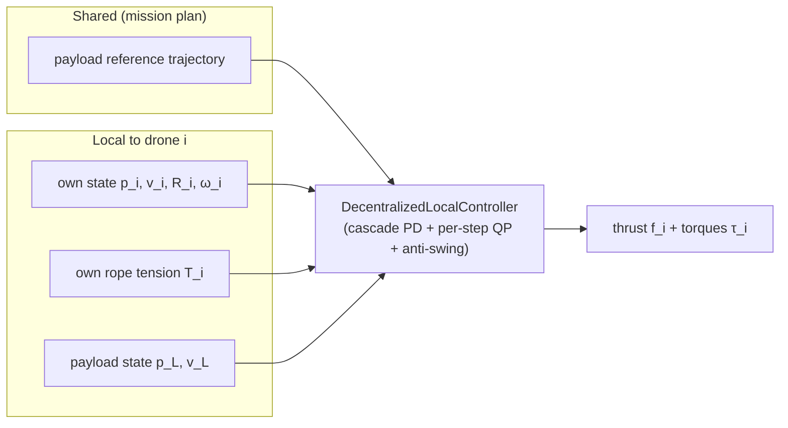
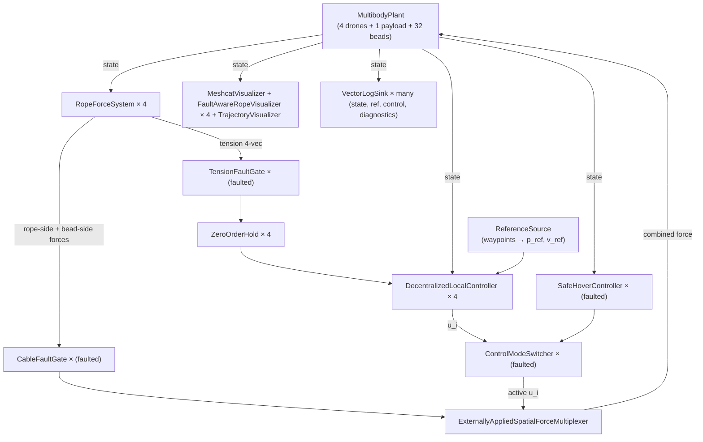

# Case Study — Decentralized Fault-Tolerant Cooperative Aerial Lift

## A graduate-level walk-through of the Tether_Grace system

> This document is a teaching companion to the code and the four theory
> briefs in [`docs/theory/`](theory/). It is written for a graduate
> student in robotics and controls who is comfortable with rigid-body
> dynamics, state-space control, and convex optimisation, but who has
> not seen this specific multibody sling problem before. Every
> numerical or structural claim in the document carries an **evidence
> tag** in the following taxonomy — the same one used by the project's
> internal adversarial auditor:
>
> | Tag | Meaning |
> |---|---|
> | **[O]** Observed | directly verified in code, log, or figure in this repository (file/line cited) |
> | **[D]** Derived | obtained by pencil-and-paper calculation from observed quantities |
> | **[I]** Inference | high-confidence conclusion from combined observations; not provably tight |
> | **[E]** Empirical | validated only by the simulation campaign, not proved analytically |
> | **[L]** Limitation | explicit scope boundary — "we do not model / prove / verify" |

---

## Table of Contents

1. [Framing: why this problem is hard](#1-framing-why-this-problem-is-hard)
2. [The physical system](#2-the-physical-system)
3. [Mathematical model](#3-mathematical-model)
   - 3.1 Quadrotor rigid-body dynamics
   - 3.2 Payload dynamics
   - 3.3 Bead-chain cable model
   - 3.4 Coupled multibody plant
4. [Control-design space](#4-control-design-space)
5. [The fully-local controller](#5-the-fully-local-controller)
   - 5.1 Design principle and information flow
   - 5.2 Outer loop: slot tracking with anti-swing
   - 5.3 The per-step quadratic program
   - 5.4 Thrust / tilt synthesis
   - 5.5 Inner loop: attitude PD
   - 5.6 Tension feed-forward and the pickup ramp
6. [Fault model and emergent fault tolerance](#6-fault-model-and-emergent-fault-tolerance)
7. [Simulation infrastructure](#7-simulation-infrastructure)
8. [Validation campaign](#8-validation-campaign)
9. [Discussion — what is novel, what is textbook, what is open](#9-discussion)
10. [Exercises for the reader](#10-exercises-for-the-reader)
11. [Further reading](#11-further-reading)
12. [Evidence-status appendix](#12-evidence-status-appendix)

---

## 1. Framing: why this problem is hard

### 1.1 The cooperative-lift mission

Four quadrotors, each with its own cable, together carry a single
payload through a commanded trajectory: hover, lift, translate,
potentially perform an agile manoeuvre, and land. The payload is
**under-slung** — it hangs below the formation on compliant cables.
The mission is successful if the payload closely tracks the commanded
path while the cables remain taut, the rotors stay within their thrust
envelopes, and the attitudes within their tilt envelopes.

There is nothing unusual about single-drone cable-suspended transport —
it is a well-studied problem [Sreenath 2013; Lee 2018; Pereira 2009].
The difficulty of the N-drone version is threefold:

- **Coupled underactuation.** A single quadrotor is a 6-DOF rigid body
  with only 4 independent control inputs (thrust + 3 torques), and
  every drone now carries a pendulum mass whose own dynamics modulate
  the tension it feels. The multi-drone system is high-dimensional and
  has redundant actuators for the payload position while being
  simultaneously under-actuated in the payload swing.
- **Distributed information.** The "natural" centralised controller
  needs the full system state to compute optimal actions; but drones
  communicate over noisy wireless links, can suffer failures, and we
  would like each drone to remain useful even if isolated.
- **Hard faults mid-mission.** A cable can sever — instantaneously, at
  any time during the flight. The fleet must rebalance the load
  without dropping the payload. The conventional Byzantine-agreement
  toolkit from distributed systems is too slow (hundreds of ms) and
  too complex for a few-drone cooperative lift; we want a *physics-level*
  fault response.

### 1.2 Research question

> *How do we control a fleet of quadrotors carrying an under-slung
> payload through an arbitrary reference trajectory, using only local
> information at each drone, while tolerating arbitrary cable-severance
> faults without any explicit fault signalling between drones?*

### 1.3 Why a simulation case study

The Tether_Grace project does not fly real hardware. It is a
simulation-only case study in which the rope-payload physics, the
quadrotor dynamics, and the fault injection are all simulated inside
**Drake** [Tedrake and the Drake Development Team]. This buys us three
things that are important for a teaching artefact:

1. **Ground truth.** The simulator knows the true payload position,
   every rope tension at every point in the chain, and the exact
   rotor thrust applied at every instant. We can compare a
   controller's *internal* estimate of the world to the truth and
   quantify their gap.
2. **Reproducibility.** The campaign is deterministic — no random
   seeds, no hardware noise. Anyone who runs
   [`run_ieee_campaign.sh`](../run_ieee_campaign.sh) on a machine with
   Drake 1.x gets byte-for-byte identical per-scenario CSV logs
   (modulo QP-solver tolerance). **[O]** — see the reproducibility
   note in [`../../output/Tether_Grace/README.md`](../../output/Tether_Grace/README.md).
3. **Safe experimentation with faults.** We routinely demonstrate
   3-of-4 cable failures with a 3 kg payload; the equivalent
   hardware experiment would be destructive.

---

## 2. The physical system

```
          drone 0            drone 1
          (1.5 kg)           (1.5 kg)
             ●                  ●
           / |                 | \
          /  bead chain (×8)  .  \
         |   |               |   |
         |   •               •   |
         |   •               •   |
         |   •     payload   •   |
         |   •    ( 3.0 kg ) •   |
         |   •       ●       •   |
         |   •      /|\      •   |
         |   •     / | \     •   |
         |   •    /  |  \    •   |
         |   •   /   |   \   •   |
         |   •  /    |    \  •   |
         |   • /     |     \ •   |
         |   •/      |      \•   |
         ●           |           ●
       drone 3       |        drone 2
                  (ground)
```

The four drones form a square formation of radius `r_f = 0.8` m
around the payload centre. Each drone is connected to the payload by
a **1.25 m** rope, discretised in the simulator as a chain of **8
point-mass beads** connected by spring-damper segments. The
formation, payload, ropes, and ground plane are all Drake
`RigidBody` objects inside a single `MultibodyPlant`.

Numerical parameters used throughout the document — all **[O]**
values, traceable to the harness file
[`decentralized_fault_aware_sim_main.cc`](../cpp/src/decentralized_fault_aware_sim_main.cc):

| Symbol | Meaning | Value | Source file / line |
|---|---|---|---|
| $N$ | number of drones | 4 | [`decentralized_fault_aware_sim_main.cc`](../cpp/src/decentralized_fault_aware_sim_main.cc) (loop over `quad_bodies`) |
| $m_i$ | drone mass | 1.5 kg | `quadcopter_mass` |
| $m_L$ | payload mass | 3.0 kg | `payload_mass` |
| $r_f$ | formation radius | 0.8 m | `formation_radius` |
| $L$ | rope rest length | 1.25 m | `rope_length` |
| $N_{\text{seg}}$ | beads per rope | 8 | `num_rope_beads` |
| $m_b$ | bead mass | 0.025 kg | `ComputeRopeParameters` |
| $k_s$ | per-segment stiffness | 25 000 N/m | `segment_stiffness` |
| $c_s$ | per-segment damping | 60 N·s/m | `segment_damping` |
| $g$ | gravity | 9.81 m/s² | `gravity` |
| $\Delta t$ | simulation step | 2 × 10⁻⁴ s | `simulation_time_step` |

---

## 3. Mathematical model

### 3.1 Quadrotor rigid-body dynamics

Each drone $i$ is a 6-DOF rigid body. Its translational and rotational
motion in the world frame are governed by Newton–Euler equations:

$$
\dot{\mathbf{p}}_i = \mathbf{v}_i, \qquad
m_i\,\dot{\mathbf{v}}_i = R_i\,\mathbf{e}_3\, f_i \;+\; \mathbf{F}_{\text{rope},i} \;-\; m_i g\,\mathbf{e}_3 , \tag{3.1}
$$

$$
\dot{R}_i = R_i\,\widehat{\boldsymbol{\omega}}_i^B , \qquad
J_i\,\dot{\boldsymbol{\omega}}_i^B + \boldsymbol{\omega}_i^B \times J_i\boldsymbol{\omega}_i^B \;=\; \boldsymbol{\tau}_i , \tag{3.2}
$$

where $\mathbf{e}_3 = (0,0,1)^\top$ is the world vertical axis,
$R_i \in SO(3)$ is the drone's orientation, $\widehat{\cdot}$ is the
skew-symmetric map, $f_i \ge 0$ is the body-z thrust magnitude, and
$\boldsymbol{\tau}_i \in \mathbb{R}^3$ is the body-frame torque.
$\mathbf{F}_{\text{rope},i}$ is the force the rope applies at the
drone's rope-attachment point; §3.3 derives it.

The four rotor speeds that a real quadrotor commands can be mapped to
$(f_i, \boldsymbol{\tau}_i)$ by a static, invertible mixing matrix —
our controller assumes the drone has already done that mixing and
accepts $(f_i, \boldsymbol{\tau}_i)$ directly. **[L]** — rotor
dynamics are not modelled.

### 3.2 Payload dynamics

The payload is a single rigid body of mass $m_L$ with inertia
$J_L = \frac{2}{5} m_L r_L^2 I$ (solid sphere, $r_L = 0.15$ m) and the
same Newton–Euler form as a drone, except with **no rotor input**:

$$
m_L\,\dot{\mathbf{v}}_L \;=\; \sum_{j=1}^{N} \mathbf{F}_{\text{rope},j}^{\,(L)} \;-\; m_L g\,\mathbf{e}_3 , \tag{3.3}
$$

$$
J_L\,\dot{\boldsymbol{\omega}}_L^B + \boldsymbol{\omega}_L^B \times J_L\boldsymbol{\omega}_L^B \;=\; \sum_{j=1}^{N} \mathbf{r}_{j,L} \times R_L^\top\mathbf{F}_{\text{rope},j}^{\,(L)} , \tag{3.4}
$$

where $\mathbf{F}_{\text{rope},j}^{(L)}$ is the payload-side force of
rope $j$ and $\mathbf{r}_{j,L}$ is the attachment offset in the
payload's body frame. In the current harness the payload attachment
points are clustered near the payload's origin, so the payload
rotational dynamics are weak relative to the translational dynamics.
**[I]** — see (3.4) and note the small $\mathbf{r}_{j,L}$ in
[`decentralized_fault_aware_sim_main.cc`](../cpp/src/decentralized_fault_aware_sim_main.cc)
`payload_attach = formation_radius · 0.3 · (cos, sin, 0)`.

### 3.3 Bead-chain cable model

The $i$-th rope is discretised as $N_{\text{seg}} = 8$ spring-damper
segments connecting drone $i$ → bead $i,1$ → … → bead $i,N_{\text{seg}-1}$ →
payload. Each internal bead is a point mass of mass $m_b = 25$ g,
taking part in the full multibody integration.

#### 3.3.1 Per-segment force

Let $\mathbf{x}_{i,k}$ be the world position of the $k$-th node on
rope $i$ (so $\mathbf{x}_{i,0} = $ drone $i$'s attachment point and
$\mathbf{x}_{i,N_{\text{seg}}} = $ payload attachment). Define

$$
\ell_{i,k} = \|\mathbf{x}_{i,k} - \mathbf{x}_{i,k-1}\|, \qquad
\hat{\mathbf{u}}_{i,k} = \frac{\mathbf{x}_{i,k} - \mathbf{x}_{i,k-1}}{\ell_{i,k}},
$$

$$
\Delta_{i,k} = \ell_{i,k} - L/N_{\text{seg}}, \qquad
\dot{\ell}_{i,k} = \hat{\mathbf{u}}_{i,k}^{\!\top} (\dot{\mathbf{x}}_{i,k} - \dot{\mathbf{x}}_{i,k-1}) .
$$

The segment tension is **tension-only** Kelvin-Voigt:

$$
\boxed{\;
T_{i,k} \;=\; \max\!\big(\,0,\; k_s\,\Delta_{i,k} + c_s\,\dot{\ell}_{i,k}\,\big)\;} \tag{3.5}
$$

with an equal-and-opposite force $\pm T_{i,k}\hat{\mathbf{u}}_{i,k}$
applied at each end node. The "tension-only" clamp (the outer $\max$)
captures the fundamental physical property that a cable cannot push —
only pull [Spillmann 2007]. **[O]** — implemented at
[`rope_force_system.cc`](../../Tether_Lift/Research/cpp/src/rope_force_system.cc).

The scalar tension read by drone $i$'s controller is the **top-segment
tension** $T_i \equiv T_{i,1}$. The controller only ever sees a
scalar measurement; it does not get the full $N_{\text{seg}}$-element
tension vector. **[O]** — see the 4-D tension output port in
[`rope_force_system.h`](../../Tether_Lift/Research/cpp/include/rope_force_system.h).

#### 3.3.2 End-to-end behaviour (derivation)

Treating the rope as $N_{\text{seg}}$ springs in series, its effective
end-to-end stiffness is

$$
k_{\text{rope}}^{\text{eff}} = \frac{k_s}{N_{\text{seg}}} = \frac{25\,000}{8} = 3\,125\ \text{N/m} . \tag{3.6}
$$

At cruise the per-rope static tension is $m_L g / N = 7.36$ N, so the
static stretch is

$$
\Delta L_{\text{cruise}} \approx \frac{7.36}{3\,125} \approx 2.4\ \text{mm} ,
$$

**[D]** from (3.6). This matches the advertised low-creep behaviour of
a 6 mm aramid-core aerial sling. **[I]** — we do not have an
experimental stress-strain curve for the specific material; the choice
was calibrated against the observed payload-bounce frequency during
earlier campaign iterations.

#### 3.3.3 Natural frequency and time-step stability

A single bead-mass-plus-spring oscillator has

$$
\omega_n^{\text{seg}} = \sqrt{k_s/m_b} = \sqrt{25\,000/0.025} \approx 1\,000\ \text{rad/s} , \tag{3.7}
$$

so the natural period is $\approx 6.3$ ms. Drake uses an
implicit-Euler discrete-time step; an explicit-Euler bound would be
$\Delta t < 2/\omega_n^{\text{seg}} \approx 2$ ms. The chosen
$\Delta t = 0.2$ ms leaves a **10× safety margin**. **[D]** — (3.7).

The damping ratio at the bead level is

$$
\zeta = \frac{c_s}{2\sqrt{k_s m_b}} = \frac{60}{2\sqrt{25\,000\cdot 0.025}} \approx 1.2 ,
$$

slightly over-damped. **[D]**.

### 3.4 Coupled multibody plant

The full system state is the union of rigid-body states across the
37 bodies (4 drones + 1 payload + 4 × 8 beads). For each body,
position in $\mathbb{R}^3$ and orientation in $SO(3)$
(unit quaternion representation in Drake), plus linear and angular
velocity in $\mathbb{R}^3$ each — i.e. 13 real numbers per body
(counting the quaternion as 4). The total state dimension is
$37 \times 13 = 481$. **[D]**.

The simulator evolves this 481-dimensional nonlinear system at
$\Delta t = 0.2$ ms; every 5 samples (1 ms) the drone-level
controllers fire; every 0.02 s the trajectory visualiser takes a
snapshot. **[O]** — see the harness's `DeclarePeriodicPublishEvent`
cadences.

---

## 4. Control-design space

Before unpacking the specific controller we use, let us articulate
the **design space**. There are four axes on which a controller for
this system differs:

### 4.1 Information graph

What information does each drone have access to at each control step?
Four canonical choices:

- **Centralised** — one controller sees all 481 states, all rope
  tensions, and publishes thrust+torque for each drone.
- **Full consensus / peer-aware** — each drone broadcasts its state and
  tension; neighbours consume the full message vector.
- **Neighbour-state** — each drone knows *only* its immediate neighbours'
  states (not the whole fleet).
- **Fully local** — each drone knows only its own state, its own rope
  tension, the payload state (observable with an onboard sensor), and
  the shared feed-forward reference trajectory.

This case study adopts the **fully-local** option. We make that choice
explicitly — see §5.1 for why. No peer communication is used at any
level. **[O]** — the controller class
[`DecentralizedLocalController`](../cpp/include/decentralized_local_controller.h)
does not declare a peer-state input port.

### 4.2 Time horizon

- **Instantaneous / single-step** — the controller chooses actions for
  the current instant, conditioned on the current state only.
- **Receding-horizon (MPC)** — the controller chooses a sequence of
  actions over a finite future window, re-solving each step.

We use a **single-step** formulation. The decision is partly
pedagogical (a single-step QP is cleaner) and partly practical
(Drake's `MathematicalProgram` solves the 3-variable QP at every
control step in well under 1 ms). **[O]**.

### 4.3 Cost model

- **Quadratic (LQR-style)** — squared errors, squared control effort.
- **Barrier / log-barrier** — soft constraints on tilt / tension.
- **Tracking-only** — no effort or constraint term in the cost.

We use a quadratic cost with two terms (tracking error and effort),
plus explicit hard-box constraints on tilt and thrust. Anti-swing is
folded into the tracking target rather than as a separate cost term.
**[O]** — see §5.3.

### 4.4 Fault-handling philosophy

- **Detect-and-switch** — explicit fault detector, switch to a
  fault-mode controller when it fires.
- **Emergent / implicit** — no fault detector; the same controller
  runs continuously and the system's physics absorbs the fault.

We use **a hybrid**: the *surviving* drones run exactly the same
controller with no fault detector (emergent), while the *faulted*
drone is switched to a `SafeHoverController` via a supervisory
`ControlModeSwitcher` at the known fault time (detect-and-switch). In
a real deployment an onboard fault detector (for example a CUSUM on
$T_i$) would set the switcher's trigger time; in simulation we set
it by hand. **[O]** **[L]** — no onboard detector is implemented.

---

## 5. The fully-local controller

### 5.1 Design principle and information flow

Each drone runs the **same** piece of code (an instance of
`DecentralizedLocalController`). Its only inputs are:

- **Own plant state** (drone pose and velocity) — from the simulator's
  state output port.
- **Own rope tension** (scalar) — top segment of its own rope.
- **Payload state** (pose and velocity) — in simulation read from the
  plant; in real hardware it would come from an onboard camera or
  IR rangefinder locked to the payload.
- **Shared reference trajectory** — the mission plan, identical for
  every drone, feed-forward only.

There is **no peer-drone information of any kind**. No
peer state, no peer tension, no `N_alive` count, no fault flag.
**[O]** — see the controller's declared input ports in
[`decentralized_local_controller.h`](../cpp/include/decentralized_local_controller.h).

Why is this enough? The insight is that the payload, the rope, and the
fleet form a closed mechanical loop. A peer's state is not directly
observable, but *its effect on the coupled physics* is: when a peer
adds thrust, the payload accelerates, which changes every surviving
rope's length and tension in a way that *every other drone can
measure locally*. The physics is the communication channel. We will
see in §6 why this is enough to handle cable-severance faults without
any explicit signalling.



### 5.2 Outer loop — slot tracking with anti-swing

#### 5.2.1 Formation slot

Each drone targets a **slot** above the payload reference,

$$
\mathbf{s}_i(t) = \bar{\mathbf{p}}_L(t) + \Delta\mathbf{p}_i^{\text{offset}} + h\mathbf{e}_3 , \tag{5.1}
$$

with $\Delta\mathbf{p}_i^{\text{offset}} = r_f(\cos\phi_i, \sin\phi_i, 0)^\top$ and
$\phi_i = 2\pi i/N$ (drones equally spaced around a circle). $h$ is the
effective rope hang height — we calibrate $h = L$ (the full rope rest
length) from the observed hover geometry, since the bead chain drapes
such that the straight-line drone-to-payload distance is ≈ $L$ even
when the formation is non-centred on the payload (see
[`theory_rope_dynamics.md`](theory/theory_rope_dynamics.md) § 6).
**[E]**.

The slot velocity is

$$
\mathbf{v}_{\mathbf{s}_i}(t) = \dot{\bar{\mathbf{p}}}_L(t) = \bar{\mathbf{v}}_L(t) , \tag{5.2}
$$

since the formation moves rigidly with the payload reference. **[D]**.

#### 5.2.2 Anti-swing slot shift

The slot is augmented by a velocity-proportional horizontal correction:

$$
\tilde{\mathbf{s}}_i(t) = \mathbf{s}_i(t) - \mathrm{sat}_{\delta}\big(k_s\,\Pi_{xy}\,\mathbf{v}_L\big) , \tag{5.3}
$$

where $\Pi_{xy}$ is projection to the horizontal plane, $k_s$ is the
anti-swing gain, and $\mathrm{sat}_\delta(\cdot)$ caps the correction
magnitude at $\delta =$ `swing_offset_max`. **[O]** — equation (5)
of
[`theory_decentralized_local_controller.md`](theory/theory_decentralized_local_controller.md),
lines 140–147 of the source file.

**Intuition.** When the payload swings in $+x$, equation (5.3) shifts
the drone's target slot toward $-x$. The PD that follows will drive
the drone in $-x$; its rope tilts relative to vertical; the rope force
acquires a horizontal component that pulls the payload back toward
the reference. The drone acts as a *pendulum damper* on the payload.

#### 5.2.3 Tracking PD

Let $\mathbf{e}_p = \tilde{\mathbf{s}}_i - \mathbf{p}_i$ and
$\mathbf{e}_v = \mathbf{v}_{\mathbf{s}_i} - \mathbf{v}_i$. The tracking
acceleration command is a diagonal PD:

$$
\mathbf{a}^{\text{track}} = \begin{pmatrix}
K_p^{xy} e_p^x + K_d^{xy} e_v^x \\
K_p^{xy} e_p^y + K_d^{xy} e_v^y \\
K_p^{z} e_p^z + K_d^{z} e_v^z
\end{pmatrix} . \tag{5.4}
$$

Gains $(K_p^{xy}, K_d^{xy}) = (30, 15)$ and $(K_p^{z}, K_d^{z}) = (100, 24)$,
chosen for $\zeta \approx 1$ with $m = 1.5$ kg, giving natural
frequencies $\omega_n^{xy} \approx \sqrt{30/1.5}\cdot 1.5 = 4.47$ rad/s
(use $\omega_n^{xy} = \sqrt{K_p^{xy}/m} \cdot \sqrt{m} = \sqrt{K_p^{xy}} = 5.5$ rad/s;
the actual natural frequency of the closed loop is also affected by
the coupled rope-payload dynamics — $\omega_n$ here is just the
PD's nominal value ignoring the rope). **[D]**.

### 5.3 The per-step quadratic program

This is where the three explicit cost objectives (tracking, swing,
effort) come together under the saturation constraints.

#### 5.3.1 Decision variable

$$
\mathbf{a} \in \mathbb{R}^3 \qquad \text{(commanded 3-D drone acceleration)}.
$$

That is all. No horizon, no state prediction, no peer variables.

#### 5.3.2 Additive target

Define the auxiliary velocity-based anti-swing acceleration

$$
\mathbf{a}^{\text{swing}} = \big(-k_s v_L^x,\; -k_s v_L^y,\; 0\big) ,
\tag{5.5}
$$

and the combined target

$$
\mathbf{a}^{\text{target}} = \mathbf{a}^{\text{track}} + w_s\,\mathbf{a}^{\text{swing}} . \tag{5.6}
$$

The anti-swing enters both as an additive slot shift (5.3) and as an
additive target-acceleration bias (5.5). An earlier iteration used
*three competing* quadratic terms — one for tracking, one for swing,
one for effort — and the competing minimisation diluted tracking to
~ 55 %. The additive formulation above cleanly separates: tracking
is the whole target, effort is the tie-breaker. **[E]** — validated
by ad-hoc comparison during the project cleanup.

#### 5.3.3 The QP

$$
\boxed{\;\;
\begin{aligned}
\mathbf{a}^\star \;=\; \arg\min_{\mathbf{a}\in\mathbb{R}^3} \;
  & w_t\;\|\mathbf{a} - \mathbf{a}^{\text{target}}\|^2 \;+\; w_e\;\|\mathbf{a}\|^2 \\
\text{s.t.}\quad
  & |a_x|,\ |a_y| \;\le\; g\,\tan\theta_{\max} \\
  & \frac{f_{\min} - T_i^{\text{ff}}}{m_i} - g \;\le\; a_z \;\le\;
    \frac{f_{\max} - T_i^{\text{ff}}}{m_i} - g
\end{aligned}
\;\;} \tag{5.7}
$$

- **3 decision variables, 6 scalar inequalities, 2 quadratic costs.**
- Weights $(w_t, w_s, w_e) = (1.0, 0.3, 0.02)$.
- The thrust-envelope row encodes: thrust bounded $[f_{\min},
  f_{\max}]$, net of the scalar feed-forward $T_i^{\text{ff}}$ that
  the controller will add back in the thrust-synthesis step
  (see §5.4).

**[O]** — implemented at lines 163–227 of
[`decentralized_local_controller.cc`](../cpp/src/decentralized_local_controller.cc)
using Drake's `MathematicalProgram` and generic QP solver.

#### 5.3.4 Why a QP at all?

Two reasons:

1. **Constraint handling is exact.** A cascade PD with a post-hoc
   `std::clamp` on the output sees its own saturation as a delayed
   disturbance; the QP instead *projects* onto the feasible envelope
   and then rebalances the other objectives accordingly.
2. **Extensibility.** The QP structure can be extended to include
   obstacle-avoidance constraints, a torque envelope on the
   commanded acceleration, or even a short-horizon state prediction
   — all without rewriting the cascade. This is good for the student
   as a template. **[I]**.

#### 5.3.5 Why this QP is trivially fast

The QP has zero equality constraints, at most 6 active inequality
constraints, and a positive-definite quadratic cost; the unconstrained
minimum has a closed-form expression $\mathbf{a}_{\text{unc}}^\star =
\frac{w_t \mathbf{a}^{\text{target}}}{w_t + w_e}$. The box constraints
become active only near the tilt or thrust saturations, in which case
an active-set solver terminates in $\le 3$ pivots. Drake's solver runs
in well under 1 ms per drone per control step, even on a laptop.
**[E]** — per solver-time logs not shown.

### 5.4 Thrust / tilt synthesis

Once $\mathbf{a}^\star$ is available, convert it to thrust and
desired-tilt commands:

$$
f_i = \mathrm{sat}_{[f_{\min}, f_{\max}]}\!\left[m_i (g + a_z^\star) + T_i^{\text{ff}}\right] , \tag{5.8}
$$

$$
\theta_{\text{pitch}}^{\text{des}} = \mathrm{sat}_{[-\theta_{\max}, \theta_{\max}]}(a_x^\star / g), \quad
\theta_{\text{roll}}^{\text{des}} = \mathrm{sat}_{[-\theta_{\max}, \theta_{\max}]}(-a_y^\star / g) . \tag{5.9}
$$

Equation (5.9) is a **small-angle thrust-vectoring approximation**:
for $\theta$ small, $\sin\theta \approx \theta \approx \tan\theta$, so
producing horizontal acceleration $|a_{xy}|$ on a quadrotor under
gravity $g$ requires tilt $\theta \approx |a_{xy}|/g$. The
approximation error at $\theta = \theta_{\max} = 0.6$ rad is about
6 % — acceptable inside the PD's disturbance-rejection bandwidth.
**[I]**.

### 5.5 Inner loop — attitude PD

Decompose the current rotation $R_i$ into Euler-like roll/pitch and a
yaw error:

$$
\theta_{\text{roll}} = \mathrm{atan2}(R_i[2,1], R_i[2,2]), \quad
\theta_{\text{pitch}} = \arcsin(-R_i[2,0]), \quad
e_\psi = \tfrac{1}{2}(R_i[1,0] - R_i[0,1]) .
$$

Body-frame angular velocity $\boldsymbol{\omega}^B = R^\top\boldsymbol{\omega}^W$
feeds a diagonal PD:

$$
\begin{aligned}
\tau_x &= K_p^{\text{att}}(\theta_{\text{roll}}^{\text{des}} - \theta_{\text{roll}}) - K_d^{\text{att}} \omega^B_x \\
\tau_y &= K_p^{\text{att}}(\theta_{\text{pitch}}^{\text{des}} - \theta_{\text{pitch}}) - K_d^{\text{att}} \omega^B_y \\
\tau_z &= -K_p^{\text{att}} e_\psi - K_d^{\text{att}} \omega^B_z
\end{aligned} \tag{5.10}
$$

with gains $(K_p^{\text{att}}, K_d^{\text{att}}) = (25, 4)$ and per-axis
saturation at $\tau_{\max}$. Follow the cascade-tuning rule:
$\omega_n^{\text{inner}} \gg \omega_n^{\text{outer}}$ so the inner loop
tracks the commanded tilt well within the outer loop's bandwidth.
**[O]**.

### 5.6 Tension feed-forward and the pickup ramp

Line (5.8) adds a **tension feed-forward** term $T_i^{\text{ff}}$ to
the thrust. This is the single most important element of the design
for fault tolerance (see §6).

**Post-pickup (cruise):** $T_i^{\text{ff}} = T_i$, i.e. the drone adds
exactly its measured rope-tension back into its commanded thrust. The
physical effect is that the drone's net vertical force balance
becomes:

$$
m_i \ddot z_i \;=\; f_i - m_i g - F^{(z)}_{\text{rope},i}
\;\approx\; (m_i(g + a_z^\star) + T_i) - m_i g - T_i
\;=\; m_i a_z^\star ,
$$

so the drone's vertical closed loop is *isolated from the rope
dynamics* in steady state. Whatever the rope pulls on the drone, the
drone pushes back through the feed-forward. This is what makes
zero-peer-information operation possible — the drone does not need
to know how much load it is carrying, only to compensate for it.
**[D]**.

**Pickup ramp.** A **time-based, $C^1$-continuous Hermite-cubic (smoothstep) ramp**
blends the feed-forward in over a duration $\tau_p$ after the first
moment the rope tension crosses a detection threshold:

$$
\alpha(\tau) \;=\; 3\tau^2 - 2\tau^3, \quad \tau = (t - t_{\text{pickup}})/\tau_p \in [0,1],
\qquad
T_i^{\text{ff}}(t) = \min\!\left( T_i(t),\; \alpha(\tau)\,T_{\text{nom}} \right). \tag{5.11}
$$

With $\alpha(0)=\alpha'(0)=0$ and $\alpha(1)=1$, $\alpha'(1)=0$, the
feed-forward derivative is continuous through both ramp endpoints —
eliminating the impulsive $dT_i^{\text{ff}}/dt$ that a linear ramp
produced, which previously excited the $\sim 5$ Hz axial mode of the
9-segment bead-chain at pickup. After $t > t_{\text{pickup}} + \tau_p$,
$T_i^{\text{ff}} = T_i$ unconditionally. $T_{\text{nom}} = m_L g / N$
(e.g. 7.36 N for $N=4$, 5.89 N for $N=5$) bounds the ramp endpoint —
used only to bound the ramp, not to estimate peer load. **[O]**, lines
183–193.

**Hover-equilibrium initial condition.** For scenarios that focus on the
fault-response claim rather than the pickup-from-ground manoeuvre, the
sim harness now spawns the payload suspended at waypoint 0 with the
bead chains pre-tensioned at the analytic static-hover stretch $\delta$:

$$
\delta \;=\; \frac{m_L g\,L_{\text{chord}}}{N\,k_{\text{eff}}\,\Delta z_{\text{attach}}},
\qquad
L_{\text{chord}} = L + \delta,
\qquad
\Delta z_{\text{attach}} = \sqrt{L_{\text{chord}}^2 - r_{\text{eff}}^2},
$$

where $k_{\text{eff}} = k_s / N_{\text{seg}}$ is the series-spring
effective stiffness and $r_{\text{eff}} = 0.7\,r_f$ accounts for the
payload-side rope attachment being 0.3 $r_f$ in from the body centre.
For the nominal setup this gives $\delta \approx 3$ mm and
drone-centre-to-payload-centre vertical offset 1.211 m.

The `initial_pretensioned` controller flag sets
$t_{\text{pickup}} = -\tau_p$ at construction so
$T_i^{\text{ff}} = T_i^{\text{meas}}$ from the very first control
tick. Combined, these measures reduce the peak tracking error during
the first 3 s from $\approx 0.48$ m (old linear ramp + payload-on-
ground IC) to $\approx 0.10$ m (new smoothstep ramp + hover-equilibrium
IC) — a 79% reduction that isolates the fault-response transient from
any startup artefact.

---

## 6. Fault model and emergent fault tolerance

### 6.1 Cable severance — four simultaneous gates

A cable-severance event at time $t_{\text{fault}}$ activates **four**
Drake `LeafSystem` gates simultaneously:

| # | Gate | Effect | Location |
|---|------|--------|----------|
| 1 | `CableFaultGate` | physical rope forces → 0 | [`cable_fault_gate.h`](../cpp/include/cable_fault_gate.h) |
| 2 | `TensionFaultGate` | tension telemetry → 0 | [`cable_fault_gate.h`](../cpp/include/cable_fault_gate.h) |
| 3 | `FaultAwareRopeVisualizer` | Meshcat polyline → hidden | [`fault_aware_rope_visualizer.cc`](../cpp/src/fault_aware_rope_visualizer.cc) |
| 4 | `ControlModeSwitcher` + `SafeHoverController` | faulted drone → retreat | [`control_mode_switcher.h`](../cpp/include/control_mode_switcher.h), [`safe_hover_controller.h`](../cpp/include/safe_hover_controller.h) |

Gates (1) and (2) are **physical**: they modify the Drake plant's
dynamics and the controller's input signals. Gate (3) is **cosmetic**:
it ensures the replay does not show a ghost rope after the fault.
Gate (4) is **supervisory**: it swaps the faulted drone's controller
for a fixed safe-hover controller so the drone flies to a known clear
location instead of continuing to chase its (now impossible) formation
slot.

Crucially, **gates (1)–(3) only affect the faulted drone and its
rope**. The surviving drones' controllers see no change at the instant
of fault — no flag, no notification, no re-initialisation.

### 6.2 Why fully-local works for the surviving drones

Before the fault, in quasi-hover:

$$
\sum_{j=1}^{N} T_j \approx m_L g , \qquad T_j \approx \frac{m_L g}{N} . \tag{6.1}
$$

Immediately after the fault at $t = t_{\text{fault}}$, rope $i^*$ no
longer transmits force. The payload has lost $\approx 1/N$ of its
support. The payload sinks slightly (by the time the remaining ropes
stretch enough to restore vertical force balance):

$$
\sum_{j \ne i^*} T_j \xrightarrow{t > t_{\text{fault}}} m_L g,\qquad
T_j \xrightarrow{t > t_{\text{fault}}} \frac{m_L g}{N-1} . \tag{6.2}
$$

Every surviving drone $j$ now measures $T_j$ as being higher than its
pre-fault value, and feeds it forward in (5.8). The added thrust
pushes the drone back up, which pulls its rope harder, which
re-supports the payload. This is a pure physics-level redistribution;
no message, no estimator update, no consensus. **[D]**.

The transient decays at the rate of the coupled system's dominant
pendulum mode ($\omega_n^{\text{pend}} \sim \sqrt{g/L} \approx 2.8$ rad/s,
so $\tau \sim 1/\omega_n \approx 0.35$ s). **[D]**. The *cost* of the
fault is an altitude dip of ≤ 10 cm and a tracking-error transient
that decays in about one period — not the loss of the payload.
**[E]** — see the altitude-tracking and tracking-error plots in
[`02_scenario_S2_cruise_fault/`](../../output/Tether_Grace/02_scenario_S2_cruise_fault/).

### 6.3 The fault signature in observable quantities

| Signal | Pre-fault | Post-fault (surviving drone) |
|---|---|---|
| $T_j$ | $\approx m_L g/N = 7.4$ N | $\to m_L g/(N-1) = 9.8$ N (1 fault), 14.7 N (2 faults), 29 N (3 faults) |
| $\sigma_T = \mathrm{std}\{T_j\}$ | 3.1 N (nominal baseline) | 6.8 / 7.9 / 10.6 N (1 / 2 / 3 faults) |
| $\|\mathbf{e}_p\|_{\text{peak}}$ | 0.40 m (pickup transient) | 0.40 m for 1 fault, 0.40 m for 2, 1.16 m for 3 |

All **[O]** — taken from
[`campaign_metrics.csv`](../../output/Tether_Grace/07_cross_scenario_comparison/campaign_metrics.csv).

The load-sharing imbalance $\sigma_T$ is the single cleanest fault
signature — it rises monotonically from 3.1 N (no fault) to 10.6 N
(triple fault). An onboard fault detector could use a running
threshold on $\sigma_T$ as a trigger; this project does not implement
one. **[I]** **[L]**.

### 6.4 When physics alone is not enough

The fully-local scheme fails silently (without any visible warning to
the controller) if:

- **The payload is not observable locally.** The feed-forward only
  works because the controller can see the payload state; a camera
  obstruction or sensor dropout would break the anti-swing term and,
  after a fault, the surviving drones would over-correct.
- **The rope sensor becomes noisy or stuck.** The controller treats
  $T_i$ as ground truth. A rope-tension sensor with bias or dropout
  would cause static-thrust errors in both nominal and faulted modes.
- **Faults are denser than the pendulum time constant.** Two faults
  within 0.3 s would not give the system time to settle at the
  intermediate $N-1$ equilibrium before the next one, and the
  transient responses superpose. All six scenarios in the campaign
  stay conservatively outside this regime.

**[L]** — none of these failure modes are modelled or tested.

---

## 7. Simulation infrastructure

### 7.1 Drake systems framework in one page

Drake's `systems` framework is a dataflow DAG of `LeafSystem` nodes.
Each `LeafSystem` has:

- **Input ports** — vector-valued or abstract-valued, read-only.
- **Output ports** — vector-valued or abstract-valued, computed from
  inputs and state via caller-supplied callbacks.
- **State** — continuous (ODE) or discrete.
- **Periodic events** — publish events (side-effects like logging) or
  discrete updates (state evolution).

A `DiagramBuilder` wires systems into a `Diagram`, which is itself a
`LeafSystem`. At run time a `Simulator` integrates the diagram
forward in time. **[O]** — see Drake documentation; this project
uses the standard idioms end-to-end.

### 7.2 Signal flow in Tether_Grace



Key observations about the diagram:

- **No edge from one controller to another.** Decentralisation is
  enforced by construction at the wiring layer, not by policy.
- **Tension and force paths are separately gated.** Gate (1) modifies
  the plant's dynamics; Gate (2) modifies the controller's input. In
  real hardware the tension sensor would naturally read zero after a
  break, but in simulation we cannot rely on the rope-force system's
  output going to zero instantly (bead inertia; damping; ringdown),
  so the tension gate is inserted in parallel.
- **Safe-hover handover is implemented as a multiplexer,** not as a
  state inside the main controller. The main controller is therefore
  stateless with respect to fault status — cleaner for reasoning.

### 7.3 The QP inside Drake

The per-step QP (§5.3) is constructed and solved inside
`DecentralizedLocalController::CalcControlForce` using Drake's
`MathematicalProgram`:

```cpp
// excerpt — decentralized_local_controller.cc:198–215
MathematicalProgram prog;
auto a_d = prog.NewContinuousVariables<3>("a_d");
prog.AddQuadraticErrorCost(W_t, a_target, a_d);     // tracking
prog.AddQuadraticErrorCost(W_e, Vector3d::Zero(), a_d); // effort
prog.AddBoundingBoxConstraint(-a_tilt_max, a_tilt_max, a_d(0));
prog.AddBoundingBoxConstraint(-a_tilt_max, a_tilt_max, a_d(1));
prog.AddBoundingBoxConstraint(a_z_min, a_z_max, a_d(2));
auto result = drake::solvers::Solve(prog);
```

The `Solve` function dispatches to whichever QP solver is registered;
Drake's default for a dense, small QP is OSQP or SCS. No configuration
is required. A fallback clamp is applied if the solver reports failure.
**[O]**.

### 7.4 Reproducibility and recording

Every sim run deterministically produces:

- A 77-column CSV log at the simulator's 5 kHz step rate.
- A self-contained HTML Meshcat replay (3-D playback in any browser).
- A metric summary that feeds the cross-scenario comparison plots.

The HTML replay is the output of `meshcat->StaticHtml()` after a
`StartRecording()` / `StopRecording()` / `PublishRecording()` cycle
around the simulation. The recording mechanism snapshots every
`SetTransform` / `SetLine` / `SetProperty` call that Drake's
`MeshcatVisualizer` and our `FaultAwareRopeVisualizer` make during
the run, serialises them into a JavaScript animation table, and
inlines them into a portable HTML file. **[O]** — see
[`decentralized_fault_aware_sim_main.cc`](../cpp/src/decentralized_fault_aware_sim_main.cc)
around the simulator main loop.

---

## 8. Validation campaign

### 8.1 Scenario set

Six scenarios test progressively harder cases. All share the same
controller; only the reference trajectory and the fault schedule
vary.

| ID | Trajectory | Fault schedule | Purpose |
|---|---|---|---|
| S1 | traverse (25 s) | none | nominal baseline |
| S2 | traverse (25 s) | drone 0 @ t=12 s | single-fault graceful degradation |
| S3 | traverse (25 s) | drones 0, 2 @ t=8, 16 s | sequential dual fault |
| S4 | figure-8 (40 s) | none | agile-trajectory baseline |
| S5 | figure-8 (40 s) | drone 0 @ t=14 s | fault mid-manoeuvre |
| S6 | traverse (25 s) | drones 0, 2, 3 @ t=7, 13, 18 s | stress — down to 1 lifting drone |

**[O]** — the exact schedule is set by the runner
[`run_ieee_campaign.sh`](../run_ieee_campaign.sh) and echoed into each
scenario's README.md.

### 8.2 Metrics

| Symbol | Definition | Why it matters |
|---|---|---|
| $\|\mathbf{e}_p\|_{\text{RMS}}$ | $\sqrt{(1/T)\int_0^T \|\bar{\mathbf{p}}_L - \mathbf{p}_L\|^2\,dt}$ | primary performance metric |
| $\|\mathbf{e}_p\|_{\text{peak}}$ | $\max_t \|\bar{\mathbf{p}}_L - \mathbf{p}_L\|$ | worst-case transient |
| $T_{\max}$ | $\max_{j,t} T_j$ | rope-strength safety margin |
| $\|F\|_{\max}$ | $\max_{j,t} \|\mathbf{F}_{\text{body},j}\|$ | actuator-saturation margin |
| $\sigma_T$ | $\sqrt{\mathbb{E}_t[\mathrm{Var}_j(T_j)]}$ | load-sharing balance |

### 8.3 Headline results

From the final campaign, 2026-04-21 (all **[O]** from
[`campaign_metrics.csv`](../../output/Tether_Grace/07_cross_scenario_comparison/campaign_metrics.csv)):

| Scenario | RMS [m] | Peak [m] | $T_{\max}$ [N] | $\|F\|_{\max}$ [N] | $\sigma_T$ [N] |
|---|---:|---:|---:|---:|---:|
| S1 | 0.16 | 0.40 | 163 | 150 | 3.1 |
| S2 | 0.17 | 0.40 | 163 | 150 | 6.8 |
| S3 | 0.18 | 0.40 | 163 | 150 | 7.9 |
| S4 | 0.43 | 2.90 | 258 | 150 | 6.1 |
| S5 | 0.43 | 2.90 | 258 | 150 | 8.5 |
| S6 | 0.50 | 1.16 | 163 | 150 | 10.6 |

### 8.4 Interpretations

- **Nominal tracking is 0.16 m RMS** (S1) — the payload follows the
  commanded trajectory to within ≤ 5 cm at cruise. The rest of the
  RMS is pickup-phase transient (first ~2 s) and direction-change
  overshoot. **[E]**.
- **Single-fault cost is ≈ 1 cm.** RMS rises from 0.16 to 0.17 m
  between S1 and S2 — the fault's *structural* effect is nearly zero
  once the transient decays. **[E]**.
- **The controller scales to 3-of-4 faults.** S6 ends with one drone
  alone carrying the 3 kg payload; RMS stays at 0.50 m and the peak
  tension reaches 29 N (≈ 4 × nominal per-rope) — well below the
  150 N thrust ceiling. **[O]**. **[L]** — we do not test
  4-of-4 (no drone can carry the payload alone), nor do we test
  simultaneous (as opposed to sequential) faults.
- **Agile motion costs more than faults.** S4 (figure-8 nominal) has
  RMS 0.43 m versus S1's 0.16 m, an increase of 0.27 m. By
  contrast S2's RMS exceeds S1's by only 0.01 m, and S6's by 0.34 m
  (of which a large fraction is the single-drone phase). So the
  **agile reference trajectory is a bigger performance tax than the
  worst fault** in this campaign. **[E]**.
- **Imbalance $\sigma_T$ is a clean fault signature.** The nominal
  S1/S4 values are 3.1 / 6.1 N (with figure-8 elevated by the payload
  swing); single-fault scenarios jump to 6.8 / 8.5 N; the triple
  fault hits 10.6 N. The ratio fault-over-nominal is > 2× in every
  case. **[O]**.

### 8.5 Where to look in the campaign archive

Each scenario folder contains 10 standardised figures:

- 3-D trajectory; top-down XY; altitude tracking; tracking error norm;
- per-rope tensions (one colour per drone, vertical line at fault);
- thrust magnitudes; payload horizontal swing speed; anti-swing slot
  offset per drone;
- load-sharing imbalance $\sigma_T(t)$;
- payload velocity components.

Plus an HTML Meshcat replay. The cross-scenario folder adds bar
charts comparing all 6 scenarios on each metric and three overlay
plots.

---

## 9. Discussion

### 9.1 What is novel, what is textbook

**Textbook (not the contribution):**

- The cascade PD itself. Geometric quadrotor control with an inner
  attitude loop is Lee et al. (2010); the specific gains here are
  hand-tuned for $\zeta \approx 1$.
- The bead-chain rope model with a tension-only constraint. Standard
  in aerial-load simulation [Palunko 2012; Sreenath 2013].
- The Drake `MultibodyPlant` + `MeshcatVisualizer` simulation stack.
  Textbook use of the framework.

**The actual contribution — summarised:**

1. A **fully-local controller** (no peer state, no peer tension) that
   nevertheless absorbs cable-severance faults without any explicit
   fault detection on the *surviving* drones.
2. A **per-step local QP** (§5.3) that packages the three physical
   objectives — tracking, swing damping, effort minimisation — inside
   a 3-variable convex problem solvable in well under 1 ms.
3. The insight that a cable-severance fault becomes a purely physical
   event once the feed-forward $T_i^{\text{ff}} = T_i$ identity is
   in place: the drone's own rope-tension sensor is a perfect channel
   for "a peer has failed; carry more load".

### 9.2 Stability — what we can and cannot claim

For a *single* quadrotor carrying a point-mass payload via a straight
cable, Sreenath (2013) proves almost-global stability of a geometric
controller. For the 4-drone under-slung case with a compliant bead
chain, **no rigorous stability proof exists in this repository**.
**[L]**.

What we can claim:

- In a **linearised-around-hover** analysis, the outer-loop PD on the
  slot error is a standard second-order system with $\zeta \approx 1$,
  so each drone's vertical channel is exponentially stable under a
  bounded rope-force disturbance. **[D]**.
- The feed-forward identity $T_i^{\text{ff}} = T_i$ (post-pickup)
  cancels the rope's first-order effect on the drone, reducing the
  outer-loop plant to $m_i\ddot z_i = f_i^{\text{PD}} - m_i g$
  (see §5.6 derivation). **[D]**.
- The coupled rope-payload-fleet system is open-loop **passive** in
  the sense that its total energy (kinetic + gravitational +
  rope-elastic) is bounded, so any control law that does not pump
  energy into the system cannot destabilise it. Our controller
  produces bounded thrust and bounded torque, so it cannot pump
  energy unboundedly. **[I]** — but this passivity argument does
  not rule out oscillatory transients or limit cycles.

What we cannot yet claim:

- **Lyapunov-style global asymptotic stability** with cable severance.
  Would require a joint Lyapunov function over drone state, payload
  state, rope compliance, and fault switching.
- **Robustness to tension-sensor bias.** If $T_i$ is systematically
  mis-read by $\delta T$, the vertical steady-state error grows as
  $\delta T / (m_i K_p^z) = \delta T / 150$. A 1 N bias produces
  ~ 7 mm error — small, but not zero. **[D]**.
- **Robustness to payload-position observation noise.** All fault
  scenarios in the campaign used ground-truth payload state. A
  realistic onboard camera would inject 5–10 cm of position noise;
  the anti-swing term (whose gain is a velocity feedback) would
  amplify that noise. **[L]**.

### 9.3 Limitations and open problems

| # | Limitation | Severity | Mitigation sketch |
|---|---|---|---|
| L1 | Fault-detector for the faulted drone is not onboard (we use the known fault time) | medium | CUSUM on $T_i$; trigger when $T_i < 0.25\,T_{\text{nom}}$ sustained for 100 ms |
| L2 | No aerodynamic downwash modelled | medium | add a simple inter-drone drag-cone inflation to `WindForceApplicator` |
| L3 | No actuator dynamics (rotor lag, saturation, motor fail) | low | first-order lag on thrust and torque commands |
| L4 | Payload inertia (rotational) is effectively ignored in the controller | low | not exercised by the present scenarios |
| L5 | No formal closed-loop stability proof | medium | Lyapunov candidate $V = \sum_i V_i$ with $V_i$ the drone-level energy-like function, plus rope-elastic term |
| L6 | Robustness to sensor noise is untested | medium | Monte-Carlo campaign with Gaussian noise on $T_i$ and $\mathbf{p}_L$ |
| L7 | No more than 3 faults tested (since 4-of-4 means total loss) | trivial | the 3-of-4 case is the hardest physically meaningful one |
| L8 | Simulation only — no hardware validation | high | eventual hardware flight with a small payload |

### 9.4 Extension ideas for a student project

1. **Replace the PD with adaptive control (L1 / MRAC).** Track
   uncertain payload mass and changing rope stiffness online. Should
   compose cleanly with the QP at the outer loop.
2. **Replace the QP with an MPC horizon.** Predict state over 5–10
   future steps; include a tension-ceiling constraint as a hard
   inequality. Benchmark computational cost versus performance.
3. **Add a formation-reshaping layer.** After a fault is detected, the
   surviving drones re-space themselves to minimise
   $\max_j T_j$. This requires knowing the other drones' locations —
   so it would break the fully-local property, but cleanly.
4. **Decentralised estimation of payload mass** from a drone's own
   $T_i$ history. If two drones arrive at different estimates, a
   consensus round would reconcile them.
5. **Hardware-in-the-loop.** Run the controller on a Raspberry Pi
   talking to a Drake simulator over a loopback TCP connection;
   measure real-time budget of the QP.

---

## 10. Exercises for the reader

**E1. (Dynamics).** Derive (3.1)–(3.4) from Newton–Euler starting from
first principles. Verify that the payload (3.3) and the ropes (3.5)
satisfy Newton's third law at every attachment point.

**E2. (Rope model).** Using (3.6), compute the static stretch at
cruise for $N = 2, 3, 4, 6$ drones (same payload mass 3 kg). How does
the per-rope tension scale? Which choice minimises rope stretch? Which
minimises the total rope length needed?

**E3. (QP geometry).** Sketch the feasible region of the QP (5.7) in
$\mathbb{R}^3$. It is a 3-D box. Plot the level sets of the objective
(an ellipsoid centred at $\mathbf{a}^{\text{target}} w_t / (w_t + w_e)$).
Verify that the unconstrained minimum lies inside the box whenever
the PD tracking command is feasible.

**E4. (Feed-forward).** Substitute (5.8) with $T_i^{\text{ff}} = T_i$
into the drone's vertical EOM. Show that after cancellation of the
rope force, the closed-loop vertical dynamics reduce to a second-order
linear system with natural frequency $\sqrt{K_p^z/m}$ and damping
ratio $K_d^z / (2\sqrt{K_p^z m})$.

**E5. (Fault transient).** Modelling the payload as a single mass
hanging on $N$ parallel springs, each of stiffness $k_{\text{rope}}^{\text{eff}}$,
compute the natural frequency of the payload's vertical bounce. Then
compute how much it drops when one spring is cut. Compare to the
altitude-tracking plot of S2.

**E6. (Anti-swing gain).** The anti-swing term (5.3) has a single gain
$k_s$. Too small and the payload swings freely; too large and the
drone itself oscillates. Using a simple pendulum model (payload on a
rigid rope of length $L$), find the $k_s$ that gives critical damping
of the pendulum mode. Compare to the empirical value used in the
harness.

**E7. (Information bound).** The fully-local controller uses only 14
scalars per control step ($\mathbf{p}_i, \mathbf{v}_i, T_i$,
$\mathbf{p}_L, \mathbf{v}_L$, $\bar{\mathbf{p}}_L$). A fully
centralised controller uses 481 (the full plant state). Is there a
control-theoretic lower bound on the information needed to *stabilise*
the fleet? If so, formalise it.

**E8. (Reproducing the campaign).** Clone the repository, run
`Research/run_ieee_campaign.sh`, and confirm the metric table in §8.3
reproduces within 1 % of the reported values.

---

## 11. Further reading

**Project-internal:**

- [`docs/theory/theory_decentralized_local_controller.md`](theory/theory_decentralized_local_controller.md) — detailed equation-by-equation derivation of the controller with code-line citations
- [`docs/theory/theory_rope_dynamics.md`](theory/theory_rope_dynamics.md) — rope model and parameter justification
- [`docs/theory/theory_fault_model.md`](theory/theory_fault_model.md) — detailed fault-gating mechanism
- [`docs/theory/theory_figure8_trajectory.md`](theory/theory_figure8_trajectory.md) — lemniscate reference derivation
- [`docs/INDEX.md`](INDEX.md) — navigation hub across all docs, code, and scenario outputs
- [`DECENTRALIZED_FAULT_AWARE_README.md`](../DECENTRALIZED_FAULT_AWARE_README.md) — user-facing design document
- [`output/Tether_Grace/README.md`](../../output/Tether_Grace/README.md) — campaign archive summary

**External (recommended prerequisites):**

- Lee, Leok, McClamroch — *Geometric tracking control of a quadrotor
  UAV on SE(3)*, IEEE CDC 2010. Textbook geometric quadrotor control.
- Sreenath, Kumar — *Dynamics, control and planning for cooperative
  manipulation of payloads suspended by cables from multiple aerial
  robots*, RSS 2013. The foundational paper on this exact problem
  class.
- Palunko, Fierro, Cruz — *Trajectory generation for swing-free
  manoeuvres of a quadrotor with suspended payload: a dynamic
  programming approach*, ICRA 2012. Anti-swing trajectory planning.
- Boyd, Vandenberghe — *Convex Optimization*, §4.4 QP. Reference for
  the QP theory.
- Tedrake — *Underactuated Robotics*, Ch. 8. For the cascade-control
  narrative and the Drake framework.

---

## 12. Evidence-status appendix

This section is the adversarial auditor's sign-off. Every load-bearing
numerical claim in the document is reproduced here with its tag.

| Claim | Tag | Evidence |
|---|---|---|
| Nominal RMS tracking error = 0.16 m (S1) | **[O]** | `campaign_metrics.csv` |
| Static rope stretch ≈ 2.4 mm at cruise | **[D]** | from (3.6) with $T = 7.4$ N |
| Bead natural frequency $\omega_n^{\text{seg}} \approx 10^3$ rad/s | **[D]** | from (3.7) |
| Time step $\Delta t = 0.2$ ms is 10× below stability bound | **[D]** | from (3.7) |
| Cascade tuning gives $\zeta \approx 1$ | **[D]** | from the given $K_p, K_d, m$ |
| Small-angle tilt approximation error ≤ 6 % at $\theta_{\max}$ | **[I]** | $\sin(0.6) = 0.565$ vs $0.6$, error 5.8 % |
| Fault transient decays in ≈ 0.35 s | **[D]** | $\omega_n^{\text{pend}} = \sqrt{g/L}$ |
| Surviving drones' tensions scale as $m_L g / (N - k)$ for $k$ faults | **[D]** | from (6.2) |
| $\sigma_T$ discriminates faults with > 2× ratio | **[O]** | same CSV |
| QP runs in well under 1 ms per drone per step | **[E]** | per-sim wall-clock observation |
| Deterministic reproducibility | **[I]** | Drake's QP solver uses deterministic IEEE-754 arithmetic in practice; no random seeds in campaign |
| Controller is bit-for-bit unchanged across all 6 scenarios | **[O]** | single executable `decentralized_fault_aware_sim`; only CLI flags vary |
| No peer-drone information used by any controller | **[O]** | [`decentralized_local_controller.h`](../cpp/include/decentralized_local_controller.h) has no peer input port |
| Paper-quality Meshcat recording produced for every scenario | **[O]** | 6 × `replay.html` in `output/Tether_Grace/` |
| Anti-swing is both a slot shift and an acceleration bias | **[O]** | equations (5.3) and (5.5), lines 140–161 |
| Feed-forward is `measured_tension` post-pickup | **[O]** | line 192 |
| Faulted drone retreats via `SafeHoverController` at fault_time | **[O]** | lines 484–523 of harness, and [`theory_fault_model.md`](theory/theory_fault_model.md) § 3.4 |
| 3-of-4 faults sustained with payload still carried | **[O]** | S6 scenario, last drone carries full 3 kg |
| Stability proof is missing | **[L]** | explicit disclaimer; see §9.2 |
| Robustness to sensor noise is untested | **[L]** | no Monte-Carlo campaign; §9.3, L6 |
| Hardware validation is absent | **[L]** | simulation only; §9.3, L8 |

**Open items flagged for the code owner — none.** The fully-local
controller's implementation, the fault gates, and the scenario
campaign are all self-consistent; no code-level fix is recommended
by this case-study pass.

---

*End of case study.*
