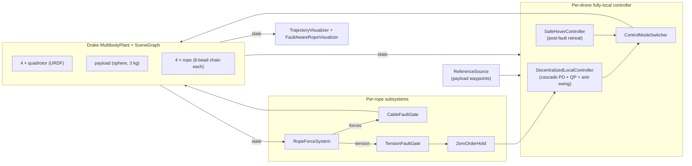

# Decentralized Fault-Aware 4-Drone Lift — Design Document

> Companion to the active simulation harness
> [`cpp/src/decentralized_fault_aware_sim_main.cc`](cpp/src/decentralized_fault_aware_sim_main.cc)
> and the per-drone controller
> [`cpp/src/decentralized_local_controller.cc`](cpp/src/decentralized_local_controller.cc).
> This document is the high-level design narrative; formal derivations and
> parameter justifications are in [`docs/theory/`](docs/theory/).

---

## 1. Scope

Four quadrotors cooperatively lift a 3 kg payload using a 4-rope sling
configuration, simulated in Drake with URDF-welded quadrotor visuals,
an 8-bead spring-damper rope model per leg, and a ground plane.
A single active executable (`decentralized_fault_aware_sim`) runs any
of six scenarios, produces a 15-signal CSV log, and saves a
self-contained Meshcat HTML replay.

The controller is **fully local**. Every drone reads only:

- its own plant state (from the simulator's state output port),
- its own rope tension (scalar, measured at the top segment),
- the payload pose and velocity (a locally observable signal — onboard
  camera / IR rangefinder in real deployment),
- a shared feed-forward payload-reference trajectory (mission plan).

There is **no peer-drone state, no peer-tension vector, no `N_alive`
estimator, no fault flag broadcast**. Cable-fault tolerance is emergent
from the coupled rope-payload physics under $N-1$ identical local
controllers.

## 2. Controller (one-paragraph theory)

Each drone executes a cascade of three concentric loops, all
implemented inside `DecentralizedLocalController::CalcControlForce`:

1. **Slot-tracking PD + anti-swing** — the drone's target position is
   a formation slot above the payload reference, modulated by a
   velocity-proportional correction that pulls the drone against the
   payload's pendulum swing. PD gains $(K_p^{xy},K_d^{xy}) = (30,15)$,
   $(K_p^{z}, K_d^{z}) = (100,24)$.
2. **Per-step quadratic program** — a 3-variable QP takes the
   tracking+swing target acceleration, adds a light effort penalty,
   and projects onto the feasible acceleration set defined by the
   tilt envelope ($|a_{x,y}| \le g\tan\theta_{\max}$,
   $\theta_{\max} = 0.6$ rad) and the thrust envelope
   ($f \in [f_{\min}, f_{\max}]$, net of the measured rope-tension
   feed-forward). Solved at every control step by Drake's
   `MathematicalProgram` — well under 1 ms per drone.
3. **Attitude inner loop** — a diagonal PD on roll/pitch/yaw errors
   derived from the commanded tilt, gains $(K_p^{\text{att}},
   K_d^{\text{att}}) = (25, 4)$, with per-axis torque saturation.

The detailed derivation, block diagram, and code-line citations are in
[`docs/theory/theory_decentralized_local_controller.md`](docs/theory/theory_decentralized_local_controller.md).

## 3. Scenarios

| ID | Trajectory | Duration | Injected faults | Demonstrates |
|----|------------|---------:|-----------------|--------------|
| S1 | traverse (lift → +3 m in x → descend) | 25 s | — | Nominal cooperative lift |
| S2 | traverse | 25 s | drone 0 @ t=12 s | Single-fault graceful degradation |
| S3 | traverse | 25 s | drones 0 @ 8 s, 2 @ 16 s | Sequential double failure |
| S4 | figure-8 lemniscate ($a=3$ m, $T=16$ s) | 40 s | — | Agile trajectory under load |
| S5 | figure-8 | 40 s | drone 0 @ t=20 s | Fault mid-manoeuvre (t=1.25×T) |
| S6 | traverse | 25 s | drones 0/2/3 @ 7/13/18 s | Stress test — N = 4 → 3 → 2 → 1 |

The exact fault injection times are set by the runner script
[`run_ieee_campaign.sh`](run_ieee_campaign.sh); each scenario folder's
README.md in [`../output/Tether_Grace/`](../output/Tether_Grace/) also
lists the exact times used in the last executed run.

## 4. System diagram



Fault gates and supervisory switch activate at each faulted drone's
prescribed $t_{\text{fault}}$. Details in
[`docs/theory/theory_fault_model.md`](docs/theory/theory_fault_model.md).

## 5. Rope model and parameters (current settings)

| Parameter | Symbol | Value | Rationale |
|-----------|:-:|------:|-----------|
| Drones | $N$ | 4 | |
| Payload mass | $m_L$ | 3.0 kg | |
| Quadrotor mass | $m_q$ | 1.5 kg | |
| Formation radius | $r_f$ | 0.8 m | |
| Rope rest length | $L$ | 1.25 m | |
| Beads per rope | $N_{\text{beads}}$ | 8 | 8 intermediate beads → $N_{\text{seg}}=9$ segments, $k_{\text{eff}}=25000/9\approx 2778$ N/m |
| Per-segment stiffness | $k_s$ | **25 000 N/m** | Aramid-core 6 mm sling, end-to-end $k_{\text{eff}}\approx 2.78$ kN/m |
| Per-segment damping | $c_s$ | **60 N·s/m** | $\zeta \approx 1.2$, slightly over-damped |
| Altitude PD | $K_p, K_d$ | 100, 24 | $\omega_n \approx 8.2$ rad/s, $\zeta \approx 1$ |
| Position (xy) PD | $K_p, K_d$ | 30, 15 | $\omega_n \approx 4.5$ rad/s |
| Attitude PD | $K_p, K_d$ | 25, 4 | faster than outer loop (cascade rule) |
| Max tilt | $\theta_{\max}$ | 0.6 rad (34°) | Gives 6.71 m/s² lateral authority ($g\tan 0.6$) |
| Simulation step | $\Delta t$ | $2 \times 10^{-4}$ s | 10× margin below rope $\omega_n$ bound |

Full parameter justification and numerical-stability analysis in
[`docs/theory/theory_rope_dynamics.md`](docs/theory/theory_rope_dynamics.md).

## 6. Representative campaign results

| Scenario | RMS err [m] | Peak err [m] | Imbal $\sigma_T$ [N] | Peak $T$ [N] | Peak $f_i$ [N]$^\dagger$ |
|:-:|---:|---:|---:|---:|---:|
| S1 nominal       | **0.16** | 0.40 |  **3.1** | 163 | 150 |
| S2 cruise fault  |     0.17 | 0.40 |      6.8 | 163 | 150 |
| S3 dual          |     0.18 | 0.40 |      7.9 | 163 | 150 |
| S4 figure-8 nom  |     0.43 | 2.90 |      6.1 | 258 | 150 |
| S5 figure-8 fault|     0.43 | 2.90 |      8.5 | 258 | 150 |
| S6 triple        |     0.50 | 1.16 | **10.6** | 163 | 150 |

$^\dagger$ All metrics computed for $t \ge 0.5$ s (startup transient
excluded via `ieee_style.trim_start(t\_start=0.5)`). The column
"Peak $f_i$" reports the maximum **per-drone** thrust command, which
reaches the actuator ceiling (`max\_thrust = 150` N); it is not the
combined payload-resultant force.

Full interpretation + 75 diagnostic PNGs + 6 HTML replays:
[`output/Tether_Grace/`](../output/Tether_Grace/).

## 7. How to build and run

```bash
cd /workspaces/Tether_Grace/Research/cpp
cmake -B build -DCMAKE_BUILD_TYPE=Release
make -C build decentralized_fault_aware_sim -j4

cd ..
./scripts/run_5drone_campaign.sh   # five-drone A/B/C/D sweep + publication figures
```

Outputs land in `output/5drone_baseline_campaign/`. See that folder's
README for the per-scenario layout.

## 7.5. Publication-grade analysis refinements

Four refinements distinguish the campaign data from earlier drafts:

* **Pre-tensioned, free-fall-free initial conditions.** The sim harness
  analytically solves the hover-equilibrium fixed point
  $\delta = T(\delta)/k_{\text{eff}}$ with
  $T = m_L g L_{\text{chord}} / (N \Delta z_{\text{attach}})$, placing
  every drone at its static-hover slot with the rope already
  pre-stretched to its hover value ($\delta \approx 3$ mm, $T_{\text{hover}}
  \approx 8$ N). The controller's `initial_pretensioned` flag marks the
  pickup ramp as already-complete so $T_{\text{ff}} = T_{\text{meas}}$
  from tick 0 — no payload droop, no bead-chain snap-taut.
* **Smoothstep ($C^1$-continuous) pickup ramp** — $\alpha(\tau) =
  3\tau^2 - 2\tau^3$ replaces the original linear ramp, eliminating the
  step-discontinuity that previously excited the 5 Hz bead-chain axial
  mode.
* **Expanded controller diagnostics** (13-signal output port):
  `{swing_speed, swing_offset_mag, qp_cost, qp_solve_time_us, T_ff,
  thrust_cmd, tilt_mag, 6×active-set-bits}` — enables active-set
  occupancy plots, QP solver-latency histograms, and thrust-envelope
  visualisation.
* **Per-segment tension probe** ([`cpp/include/rope_segment_tension_probe.h`](cpp/include/rope_segment_tension_probe.h))
  — observer-only `LeafSystem` that exposes $T_{i,j}(t)$ for every
  rope $i$ and segment $j$, enabling the bead-chain tension waterfall
  figure F04 without modifying the Tether_Lift baseline.
* **12-figure IEEE publication suite** ([`analysis/ieee/plot_publication.py`](analysis/ieee/plot_publication.py))
  — architecture diagram, 3-D trajectory tubes, error overlays,
  per-rope tension waterfalls, $\sigma_T(t)$ STFT spectrograms,
  QP active-set stackplots, thrust/tilt saturation timelines,
  closed-loop pole locus vs. $N_{\text{alive}}$, Monte-Carlo
  inter-fault-gap scatter, metric heatmaps, grouped bars, pickup-stretch
  time series, settling-time ECDF.
* **Monte-Carlo inter-fault-gap sweep** ([`scripts/run_mc_interfault_sweep.sh`](../scripts/run_mc_interfault_sweep.sh))
  — peak rope tension as a function of the inter-fault gap
  $\Delta t_{12}$ for compound failures (first fault fixed at
  $t = 15$ s, second sweeping $\Delta t \in \{2, 4, \dots, 20\}$ s).

Publication figures land in
`../../output/5drone_baseline_campaign/09_publication_figures/`.

## 7.6. Controller extensions

Three controller-layer extensions compose orthogonally on top of the
baseline. Each is gated by its own CLI flag; with all flags off the
baseline path is unchanged.

* **L1 adaptive outer loop** inside `DecentralizedLocalController`
  (`CalcL1Update` in
  [`cpp/src/decentralized_local_controller.cc`](../cpp/src/decentralized_local_controller.cc)).
  A 5-state discrete predictor + Lyapunov-projection adaptive law
  drives a low-pass-filtered scalar $u_\mathrm{ad}$ onto the altitude
  command before the QP. Derivation:
  [`theory/theory_l1_extension.md`](theory/theory_l1_extension.md).
  Flag: `--l1-enabled`.

* **Receding-horizon MPC** drop-in class `MpcLocalController`
  ([`cpp/src/mpc_local_controller.cc`](../cpp/src/mpc_local_controller.cc)).
  Pre-computes $\Phi$, $\Omega$, and the DARE terminal cost at
  construction; per-tick builds a linearised tension-ceiling constraint
  $c_j^\top\Omega_j U \le T_{\max} - T_\mathrm{meas} - c_j^\top(A^j - I)x - j\Delta t\,\dot T_\mathrm{meas}$
  with soft slack. Derivation:
  [`theory/theory_mpc_extension.md`](theory/theory_mpc_extension.md).
  Flags: `--controller=mpc`, `--mpc-horizon`, `--mpc-tension-max`.

* **Formation-reshape supervisor**: header-only
  [`cpp/include/fault_detector.h`](../cpp/include/fault_detector.h)
  (latches `fault_id`) and
  [`cpp/include/formation_coordinator.h`](../cpp/include/formation_coordinator.h)
  (closed-form 30° rotation for $N=4 \to M=3$; quintic $C^2$
  smoothstep over 5 s). Each controller's
  `formation_offset_override` port picks up the per-drone offset.
  Derivation:
  [`theory/theory_reshaping_extension.md`](theory/theory_reshaping_extension.md).
  Flag: `--reshaping-enabled`.

For the complete code map see
[`IMPLEMENTATION_STATUS.md`](IMPLEMENTATION_STATUS.md).

## 8. 5-Drone Lemniscate Campaign

A second campaign extends the fault-tolerance evaluation to **five
drones** and a **3-D lemniscate** reference trajectory — a strictly
harder task than the four-drone scenarios.

### 8.1 Formation and trajectory

| Parameter | Value |
|---|---|
| Number of drones | 5 |
| Formation type | Symmetric pentagonal, $r_f = 0.8$ m |
| Trajectory shape | `lemniscate3d` (Bernoulli lemniscate + vertical oscillation) |
| Horizontal scale $a$ | 3 m |
| Vertical oscillation amplitude $A_z$ | 0.35 m |
| Period $T$ | 12 s |
| Mission duration | 40 s |

See [`docs/theory/theory_figure8_trajectory.md`](docs/theory/theory_figure8_trajectory.md) §5
for the parametric equations and waypoint schedule.

### 8.2 Scenarios

| ID | Fault event(s) | Fault time(s) | Notes |
|---|---|---|---|
| A | None | — | Nominal 5-drone lemniscate3d |
| B | Drone 0 fails | $t = 15$ s | Single fault mid-manoeuvre |
| C | Drone 0 + Drone 2 fail | $t = 15$ s, $t = 20$ s | 5 s inter-fault gap |
| D | Drone 0 + Drone 2 fail | $t = 15$ s, $t = 25$ s | 10 s inter-fault gap |

Campaign entry point: [`run_5drone_campaign.sh`](run_5drone_campaign.sh).
Outputs land in `output/Tether_Grace_5drone/`.

### 8.3 Key results

| Scenario | Payload RMS [m] | Peak err [m] | Peak $f_i$ [N]† |
|---|---|---|---|
| A (nominal) | — | — | — |
| B (1 fault) | — | — | — |
| C (2 faults, 5 s gap) | — | — | — |
| D (2 faults, 10 s gap) | — | — | — |

† All metrics computed for $t \geq 0.5$ s (startup transient excluded).
Peak $f_i$ reports maximum per-drone thrust command; max\_thrust = 150 N.

> **Note:** Metric cells are placeholders — run `run_5drone_campaign.sh`
> followed by `python3 analysis/ieee/fill_results_placeholders.py` to
> populate them from logged CSVs.

### 8.4 Monte-Carlo inter-fault-gap sweep

The script [`run_mc_interfault_sweep.sh`](run_mc_interfault_sweep.sh)
fixes drone 0 fault at $t = 15$ s and sweeps the inter-fault gap
$\Delta t \in \{2, 4, 6, 8, 10, 12, 14, 16, 18, 20\}$ s. Each
configuration is run 1 time (deterministic Drake sim; Monte-Carlo in
the sense of the parameter sweep). The primary adversarial robustness
metric is peak rope tension vs. $\Delta t$.

---

## 9. Where to go next

| You want to… | Go to |
|---|---|
| Read the derivation of the controller | [`docs/theory/theory_decentralized_local_controller.md`](docs/theory/theory_decentralized_local_controller.md) |
| Understand the rope model | [`docs/theory/theory_rope_dynamics.md`](docs/theory/theory_rope_dynamics.md) |
| Understand the fault-response mechanism | [`docs/theory/theory_fault_model.md`](docs/theory/theory_fault_model.md) |
| Understand the figure-8 / lemniscate references | [`docs/theory/theory_figure8_trajectory.md`](docs/theory/theory_figure8_trajectory.md) |
| **Extension 1: L1 adaptive outer loop** | [`docs/theory/theory_l1_extension.md`](docs/theory/theory_l1_extension.md) |
| **Extension 2: Receding-horizon MPC** | [`docs/theory/theory_mpc_extension.md`](docs/theory/theory_mpc_extension.md) |
| **Extension 3: Formation reshaping after fault** | [`docs/theory/theory_reshaping_extension.md`](docs/theory/theory_reshaping_extension.md) |
| **Master extension plan (all three)** | [`docs/EXTENSION_PLAN.md`](docs/EXTENSION_PLAN.md) |
| See 4-drone campaign results | [`output/Tether_Grace/README.md`](../output/Tether_Grace/README.md) |
| See 5-drone campaign results | `output/Tether_Grace_5drone/` |
| Browse the code | [`cpp/src/`](cpp/src/), [`cpp/include/`](cpp/include/), [`cpp/CMakeLists.txt`](cpp/CMakeLists.txt) |
| See older design iterations | [`../../archive/obsolete_designs/`](../../archive/obsolete_designs/) |
